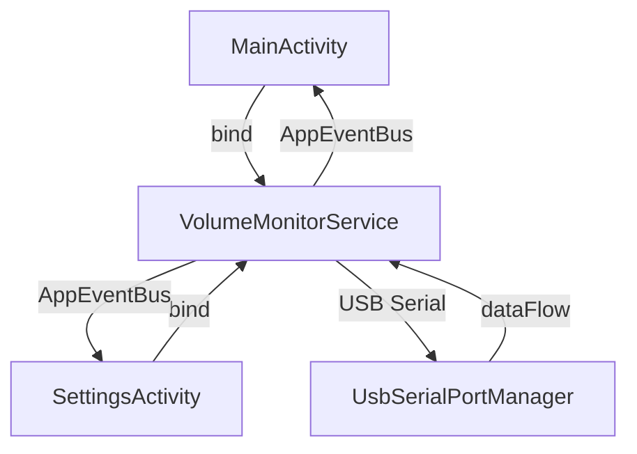
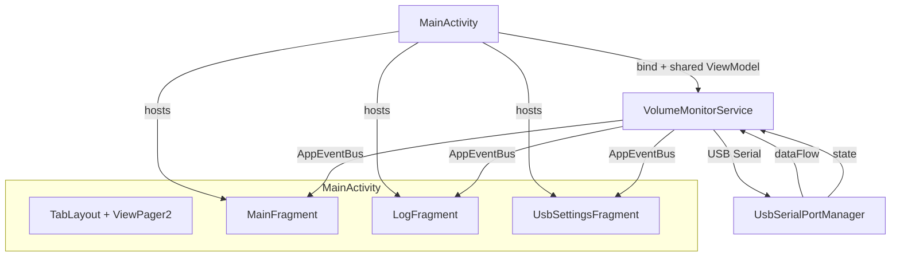
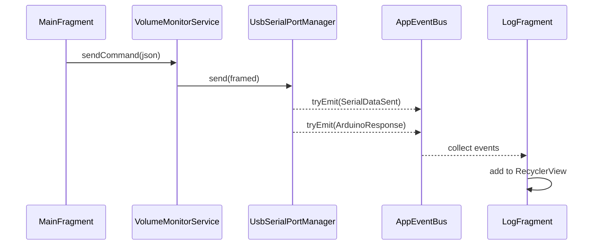
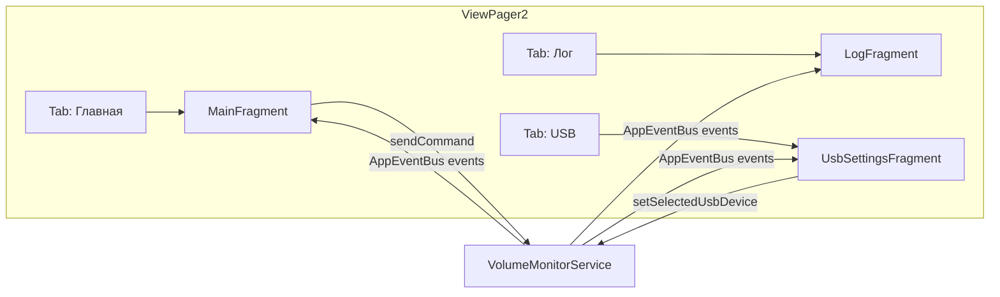

# План переработки VolumeMonitor — табы вместо отдельных Activity

## Текущее состояние



Два отдельных Activity:
- **MainActivity** — громкость, USB-статус, басс, пресет, JSON-превью, ответы Arduino (последние 10 строк с ограничением высоты)
- **SettingsActivity** — сканирование/выбор USB-устройств, запрос разрешений

Оба биндятся к `VolumeMonitorService` независимо и подписываются на `AppEventBus`.

## Целевая архитектура



**Ключевое изменение**: одно Activity с тремя табами через `TabLayout` + `ViewPager2` + `FragmentStateAdapter`. Биндинг сервиса — на уровне Activity, фрагменты получают ссылку на сервис через интерфейс или shared-объект.

## Структура табов

| Таб | Фрагмент | Содержание |
|-----|----------|------------|
| 🏠 **Главная** | `MainFragment` | Громкость, USB-статус, Bass SeekBar, пресет (отображение + кнопки «Сменить»/«Запросить») |
| 📜 **Лог** | `LogFragment` | Полноэкранный список ВСЕХ отправленных и принятых строк serial port (автоскролл) |
| ⚙️ **USB** | `UsbSettingsFragment` | Сканирование устройств, выбор, разрешения, статус (перенос из SettingsActivity) |

## Поток данных лога



**Новое событие** `AppEvent.SerialDataSent(rawLine: String)` — эмитится при каждой успешной отправке данных в порт.
`LogFragment` подписывается на оба: `SerialDataSent` (отправка → зелёный/синий) и `ArduinoResponse` (приём → серый/белый).

## Детальный план изменений

### Шаг 1. Новое событие `SerialDataSent`
**Файл**: `core/src/main/java/.../event/AppEventBus.kt`

Добавить в sealed class:
```kotlin
data class SerialDataSent(val rawLine: String) : AppEvent()
```

### Шаг 2. Эмитирование события отправки
**Файл**: `core/src/main/java/.../core/VolumeMonitorService.kt`

В методе `sendCommand()` после вызова `portManager.send(framed)` добавить:
```kotlin
AppEventBus.tryEmit(AppEvent.SerialDataSent(commandJson))
```

Альтернативно — эмитить прямо в `UsbSerialPortManager.send()` чтобы охватить и `sendVolumeData()`. Но чтобы не тянуть зависимость от `AppEventBus` в `UsbSerialPortManager`, лучше сделать это в сервисе. В `sendVolumeData()` тоже добавить эмитирование.

### Шаг 3. `LogFragment`
**Новые файлы**:
- `app/src/main/java/.../ui/LogFragment.kt`
- `app/src/main/res/layout/fragment_log.xml`

**Макет**: `RecyclerView` на весь экран с `LinearLayoutManager` (вертикальный список, автоскролл к низу). Каждая запись:
```
[HH:mm:ss.SSS] → {"command":"set_volume","value":128}
[HH:mm:ss.SSS] ← {"command":"preset_changed","value":2}
```

**Логика**:
- Подписка на `AppEventBus.events` через `lifecycleScope`
- Фильтр: `is SerialDataSent || is ArduinoResponse`
- Хранение в `MutableList<LogEntry>` с диффером для `ListAdapter`
- Автоскролл к последней записи
- Ограничение буфера (например, последние 5000 строк) для экономии памяти
- Кнопка очистки лога (FAB или в тулбаре)

### Шаг 4. `MainFragment`
**Новые файлы**:
- `app/src/main/java/.../ui/MainFragment.kt`
- `app/src/main/res/layout/fragment_main.xml`

Перенос ВСЕЙ UI-логики из `MainActivity`:
- `volumeTextView` — текущая громкость
- `usbStatusTextView` — статус USB
- `bassSeekBar` + `bassValueTextView` — регулировка басса (0–8 позиций)
- `presetTextView` — отображение текущего пресета
- `changePresetButton` + `requestPresetButton` — кнопки управления пресетом

**Удаляется**:
- `jsonTextView` (JSON-превью) → уходит в лог
- `arduinoResponseTextView` (история ответов) → уходит в лог
- `settingsButton` → заменяется табом

Фрагмент получает ссылку на сервис через `(activity as? ServiceProvider)?.getService()` или общий `ViewModel`.

### Шаг 5. `UsbSettingsFragment`
**Новые файлы**:
- `app/src/main/java/.../ui/UsbSettingsFragment.kt`
- `app/src/main/res/layout/fragment_usb_settings.xml`

Перенос ВСЕЙ логики из `SettingsActivity`:
- Сканирование USB (`usbScanButton`)
- `Spinner` с устройствами
- Выбор устройства (`selectDeviceButton`)
- Кнопка запроса разрешений
- Отображение выбранного устройства (`selectedDeviceTextView`)
- Статус USB (`usbStatusTextView`)

USB-ресивер регистрируется в `onResume` фрагмента, дерегистрируется в `onPause`.

### Шаг 6. Переработка `MainActivity`
**Файл**: `app/src/main/java/.../MainActivity.kt`

Новый код:
```kotlin
class MainActivity : AppCompatActivity() {
    private lateinit var viewPager: ViewPager2
    private lateinit var tabLayout: TabLayout
    private var volumeService: VolumeMonitorService? = null
    private var isBound = false

    // ServiceConnection — общий для всех фрагментов
    // Фрагменты получают сервис через (activity as MainActivity).volumeService
}
```

**Макет**: `activity_main.xml` → только `TabLayout` + `ViewPager2` (без ScrollView и старого содержимого).

### Шаг 7. Обновление макетов
- `activity_main.xml` — полная замена на `LinearLayout` с `TabLayout` + `ViewPager2`
- `fragment_main.xml` — новый, на основе старого `activity_main.xml`, но без `ScrollView`, без `settingsButton`, без `jsonTextView`, без `arduinoResponseTextView`
- `fragment_log.xml` — новый, `RecyclerView` на весь экран + FAB для очистки
- `fragment_usb_settings.xml` — новый, на основе старого `activity_settings.xml`

### Шаг 8. AndroidManifest и удаление
- Удалить `SettingsActivity` из манифеста (или оставить, но убрать `parentActivityName`)
- Удалить файл `SettingsActivity.kt` (после переноса кода)
- Удалить `activity_settings.xml` (после переноса)
- Убедиться, что `MainActivity` остаётся LAUNCHER

### Шаг 9. Добавление зависимости ViewPager2
**Файл**: `app/build.gradle`
```groovy
implementation 'androidx.viewpager2:viewpager2:1.0.0'
```
(Уже транзитивно через material, но лучше явно указать)

## Структура файлов после переработки

```
app/src/main/java/com/example/volumemonitor/
├── MainActivity.kt          # TabLayout + ViewPager2, биндинг сервиса
├── BootReceiver.kt          # без изменений
├── ui/
│   ├── MainFragment.kt      # Главный экран (громкость, басс, пресет)
│   ├── LogFragment.kt       # Лог serial port
│   └── UsbSettingsFragment.kt # Настройки USB
│
app/src/main/res/layout/
├── activity_main.xml        # Только TabLayout + ViewPager2
├── fragment_main.xml        # Новый макет главного экрана
├── fragment_log.xml         # Новый макет лога
└── fragment_usb_settings.xml # Новый макет настроек USB

core/ — без значительных изменений, только:
└── event/AppEventBus.kt    # + SerialDataSent
```

## Диаграмма навигации



## Примечания
- **SDK не повышается** (compileSdk 33, targetSdk 33, minSdk 18 — остаются без изменений)
- Все существующие зависимости сохраняются, добавляется только `viewpager2` (явно)
- `AppEventBus` остаётся синглтоном, подписки — через `lifecycleScope` фрагментов
- `SettingsActivity.kt` будет удалён после переноса всей логики в `UsbSettingsFragment`
- Для доступа фрагментов к сервису используется интерфейс `ServiceProvider` или прямой каст к `MainActivity`
