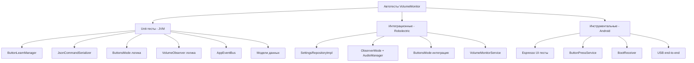
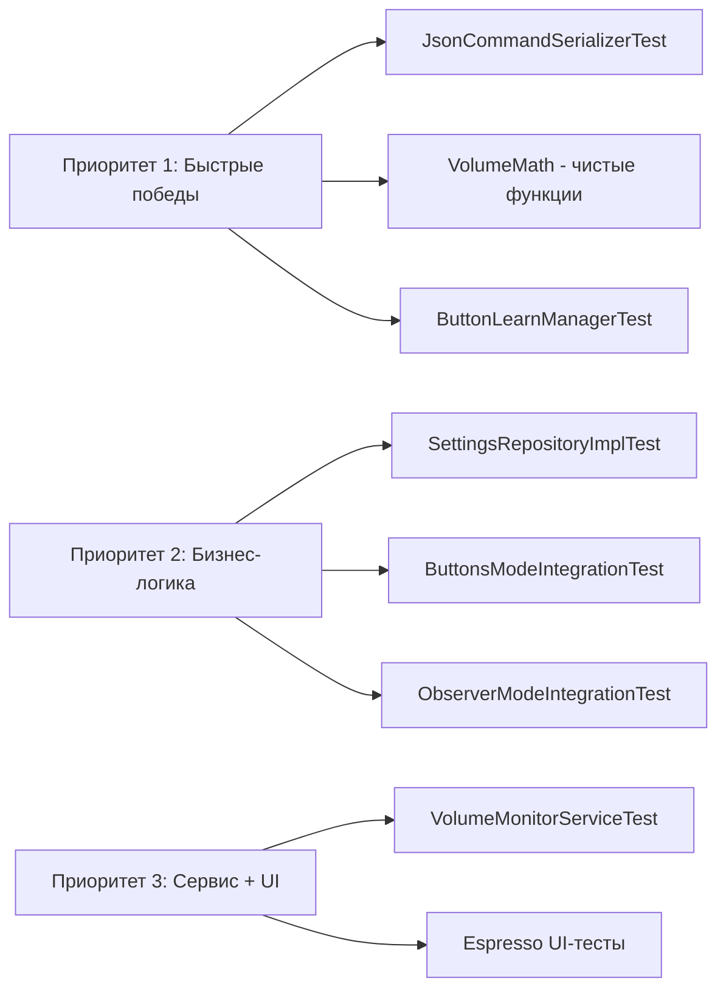

# План автотестов для VolumeMonitor

## Обзор архитектуры

Проект состоит из двух Gradle-модулей:
- **`app`** — UI-слой (Activity, Fragments, Receivers) на Kotlin + AndroidX
- **`core`** — бизнес-логика: сервис, режимы громкости, USB-коммуникация, события, кнопки

Архитектурные паттерны:
- **Событийная шина** — [`AppEventBus`](core/src/main/java/com/example/volumemonitor/core/event/AppEventBus.kt:14) на базе `SharedFlow<AppEvent>`
- **Стратегия (режимы)** — [`VolumeMode`](core/src/main/java/com/example/volumemonitor/core/volume/mode/VolumeMode.kt:38) с наследниками [`ObserverMode`](core/src/main/java/com/example/volumemonitor/core/volume/mode/ObserverMode.kt:20) и [`ButtonsMode`](core/src/main/java/com/example/volumemonitor/core/volume/mode/ButtonsMode.kt:22)
- **Репозиторий** — [`SettingsRepository`](core/src/main/java/com/example/volumemonitor/core/repository/SettingsRepository.kt:7) / [`SettingsRepositoryImpl`](core/src/main/java/com/example/volumemonitor/core/repository/SettingsRepositoryImpl.kt:9) поверх `SharedPreferences`
- **Конечный автомат** — [`ButtonLearnManager`](core/src/main/java/com/example/volumemonitor/core/button/ButtonLearnManager.kt:28) (IDLE → WAITING_FOR_PRESS → LEARNING → LEARNED)

Текущее состояние тестов:
- [`ExampleUnitTest.kt`](app/src/test/java/com/example/volumemonitor/ExampleUnitTest.kt:12) — заглушка JUnit4
- [`ExampleInstrumentedTest.kt`](app/src/androidTest/java/com/example/volumemonitor/ExampleInstrumentedTest.kt:17) — заглушка AndroidJUnitRunner
- Зависимости для тестирования: `junit:4.13.2`, `androidx.test.ext:junit:1.1.5`, `espresso-core:3.5.1`

---

## Категории тестов



---

## 1. Unit-тесты (JUnit 4, выполняются на JVM)

> **Расположение:** `core/src/test/java/com/example/volumemonitor/core/` (создать)
> **Зависимости:** уже имеется `junit:4.13.2`, потребуется добавить `mockito` или `mockk` для мокирования

### 1.1 `ButtonLearnManagerTest`

**Файл:** `core/src/test/java/com/example/volumemonitor/core/button/ButtonLearnManagerTest.kt`

**Что тестируем:** конечный автомат обучения кнопок

| # | Тест | Описание | Ожидаемый результат |
|---|------|----------|---------------------|
| 1 | `startLearning_transitionsToWaitingForPress` | После `startLearning()` состояние = `WAITING_FOR_PRESS` | `state.value == WAITING_FOR_PRESS` |
| 2 | `onKeyDown_whenWaiting_transitionsToLearning` | `onKeyDown(42)` в состоянии `WAITING_FOR_PRESS` | `state.value == LEARNING`, `progress = 0f` |
| 3 | `onKeyDown_whenIdle_ignored` | `onKeyDown(42)` в состоянии `IDLE` | `state.value == IDLE` (без изменений) |
| 4 | `onKeyDown_whenLearning_ignored` | `onKeyDown(99)` в состоянии `LEARNING` | Состояние не меняется |
| 5 | `onKeyUp_beforeTimeout_returnsToWaiting` | `onKeyUp(42)` до истечения `learnTimeoutMs` | `state.value == WAITING_FOR_PRESS`, `progress = 0f` |
| 6 | `onKeyUp_afterTimeout_transitionsToLearned` | `onKeyUp(42)` после истечения `learnTimeoutMs` | `state.value == LEARNED`, `progress = 1f`, `learnedKeyCode == 42` |
| 7 | `onKeyUp_wrongKeyCode_ignored` | `onKeyUp(99)` когда ожидается `42` | Состояние не меняется |
| 8 | `progress_updatesDuringLearning` | Прогресс обновляется во время `LEARNING` | `progress.value` растёт от 0 до 1 |
| 9 | `cancelLearning_resetsToIdle` | `cancelLearning()` из любого состояния | `state.value == IDLE`, `learnedKeyCode == null` |
| 10 | `dismiss_resetsToIdleButPreservesKeyCode` | `dismiss()` после `LEARNED` | `state.value == IDLE`, `learnedKeyCode` не сброшен |
| 11 | `activeInstance_setOnStartLearning_nullAfterDismiss` | Проверка `activeInstance` | Устанавливается при `startLearning()`, сбрасывается при `dismiss()`/`cancelLearning()` |

**Особенности реализации:** 
- Использовать `ButtonLearnManager(learnTimeoutMs = 200L)` для быстрых тестов с `Thread.sleep()` или `runBlocking` для отслеживания прогресса.
- `StateFlow` собирать через `runBlocking { state.first { ... } }`.

---

### 1.2 `JsonCommandSerializerTest`

**Файл:** `core/src/test/java/com/example/volumemonitor/core/serialization/JsonCommandSerializerTest.kt`

**Что тестируем:** сериализацию команд в JSON и фреймирование

| # | Тест | Описание | Ожидаемый результат |
|---|------|----------|---------------------|
| 1 | `serialize_setVolume` | `SetVolume(128)` → JSON | `{"command":"set_volume","value":128}` |
| 2 | `serialize_setBassLevel` | `SetBassLevel(4)` → JSON | `{"command":"set_bass_level","value":4}` |
| 3 | `serialize_changePreset` | `ChangePreset` → JSON | `{"command":"change_preset"}` |
| 4 | `serialize_getPreset` | `GetPreset` → JSON | `{"command":"get_preset"}` |
| 5 | `frame_wrapsInBracketsAndNewline` | `frame("hello")` | `[hello]\n` в виде `ByteArray` UTF-8 |
| 6 | `frame_emptyString` | `frame("")` | `[]\n` |
| 7 | `serialize_setVolume_zero` | `SetVolume(0)` | `{"command":"set_volume","value":0}` |
| 8 | `serialize_setVolume_boundary` | `SetVolume(255)` | `{"command":"set_volume","value":255}` |

---

### 1.3 `ButtonsModeLogicTest` (чистая логика)

**Файл:** `core/src/test/java/com/example/volumemonitor/core/volume/mode/ButtonsModeLogicTest.kt`

**Что тестируем:** изолированную логику конвертации громкости (формулу `buttonVolumeToPort`)

> Так как метод `buttonVolumeToPort` приватный, нужно либо:
> - **Вариант А:** вынести формулу в утилитарный класс/extension-функцию и тестировать её
> - **Вариант Б:** тестировать через `ButtonsMode` с моками `CommandSender`, `SettingsRepository`, `SharedFlow`

| # | Тест | Описание | Ожидаемый результат |
|---|------|----------|---------------------|
| 1 | `volumeToPort_zeroVolume` | `0 / 15` → порт | `0` |
| 2 | `volumeToPort_maxVolume` | `15 / 15` → порт | `255` |
| 3 | `volumeToPort_halfVolume` | `7 / 15` → порт | `119` (7 * 255 / 15 ≈ 119) |
| 4 | `volumeToPort_minNonZero` | `1 / 15` → порт | `17` (1 * 255 / 15 ≈ 17) |
| 5 | `volumeToPort_maxVolumeOne` | `1 / 1` → порт | `255` |
| 6 | `volumeToPort_exceedsMax` | `20 / 15` → порт (coerceIn) | `255` |
| 7 | `volumeToPort_negativeVolume` | `-5 / 15` → порт (coerceIn) | `0` |
| 8 | `buttonPress_volumeUp_incrementsAndClamps` | Нажатие VOLUME_UP при volume=maxVol | Громкость не превышает maxVol |
| 9 | `buttonPress_volumeDown_decrementsAndClamps` | Нажатие VOLUME_DOWN при volume=0 | Громкость не уходит ниже 0 |

**Рекомендация:** вынести функцию `buttonVolumeToPort(volume, maxVolume)` в `companion object` или отдельный утилитный класс [`VolumeConversion`](core/src/main/java/com/example/volumemonitor/core/volume/VolumeConversion.kt) для чистого тестирования без моков.

---

### 1.4 `VolumeObserverLogicTest` (чистая логика)

**Файл:** `core/src/test/java/com/example/volumemonitor/core/volume/VolumeObserverLogicTest.kt`

**Что тестируем:** формулу расчёта `target` в [`currentVolumeData`](core/src/main/java/com/example/volumemonitor/core/volume/VolumeObserver.kt:48)

> Аналогично — нужно вынести логику расчёта target в чистую функцию. Сейчас она завязана на `AudioManager`.

| # | Тест | Описание | Ожидаемый результат |
|---|------|----------|---------------------|
| 1 | `calculateTarget_zeroVolume` | current=0, max=15 | target=0 |
| 2 | `calculateTarget_maxVolume` | current=15, max=15 | target=255 |
| 3 | `calculateTarget_halfVolume` | current=7, max=15 | target≈119 |
| 4 | `calculateTarget_customMax` | current=20, max=30 (override) | target=170 (20*255/30) |
| 5 | `calculateTarget_maxOne` | current=1, max=1 | target=255 |
| 6 | `calculateTarget_overMax` | current=100, max=15 | target≤255 (coerceIn) |

**Рекомендация:** вынести расчёт target в статическую функцию:
```kotlin
fun calculateTargetVolume(current: Int, max: Int, maxTarget: Int = 255): Int
```

---

### 1.5 `AppEventBusTest`

**Файл:** `core/src/test/java/com/example/volumemonitor/core/event/AppEventBusTest.kt`

**Что тестируем:** доставку событий через `SharedFlow`

| # | Тест | Описание | Ожидаемый результат |
|---|------|----------|---------------------|
| 1 | `emit_receivedByCollector` | `tryEmit(VolumeChanged(...))` → коллектор получает | Событие доставлено |
| 2 | `multipleEvents_arriveInOrder` | Последовательная отправка 3 событий | Порядок сохраняется |
| 3 | `allEventTypes_delivered` | Отправка каждого типа `AppEvent` | Все sealed-подклассы доставляются |
| 4 | `tryEmit_doesNotThrowOnOverflow` | Быстрая отправка >16 событий | Не выбрасывается исключение |
| 5 | `ModeStateChanged_containsCorrectData` | Проверка полей события | Все поля совпадают |

---

### 1.6 Тесты моделей данных

**Файл:** `core/src/test/java/com/example/volumemonitor/core/model/ModelsTest.kt`

| # | Тест | Описание |
|---|------|----------|
| 1 | `volumeData_equality` | Два `VolumeData` с одинаковыми полями равны |
| 2 | `modeState_equality` | Два `ModeState` с одинаковыми полями равны |
| 3 | `deviceCommand_sealedHierarchy` | Все наследники `DeviceCommand` корректны (when-exhaustive) |
| 4 | `buttonAction_enumValues` | `ButtonAction.values()` содержит `VOLUME_UP`, `VOLUME_DOWN` |
| 5 | `volumeControlMode_enumValues` | `VolumeControlMode.values()` содержит `OBSERVER`, `BUTTONS` |
| 6 | `maxVolumeSource_enumValues` | `MaxVolumeSource.values()` содержит `SYSTEM`, `CUSTOM` |
| 7 | `usbPortState_displayText` | Проверка `displayText` для каждого состояния `UsbPortState` |

---

## 2. Интеграционные тесты (Robolectric)

> **Расположение:** `core/src/test/java/...` (Robolectric выполняется на JVM с симуляцией Android SDK)
> **Зависимости:** потребуется добавить `org.robolectric:robolectric` и `androidx.test:core`

### 2.1 `SettingsRepositoryImplTest`

**Файл:** `core/src/test/java/com/example/volumemonitor/core/repository/SettingsRepositoryImplTest.kt`

**Что тестируем:** сохранение/загрузку настроек через `SharedPreferences` (Robolectric даёт реальный `Context`)

| # | Тест | Описание | Ожидаемый результат |
|---|------|----------|---------------------|
| 1 | `saveAndGetDevice` | `saveDevice(0x1234, 0x5678)` → `getSavedDevice()` | `Pair(0x1234, 0x5678)` |
| 2 | `getSavedDevice_returnsNull_whenNotSaved` | Без сохранения | `null` |
| 3 | `getVolumeControlMode_defaultsToObserver` | Новый репозиторий | `VolumeControlMode.OBSERVER` |
| 4 | `saveAndGetVolumeControlMode` | `saveVolumeControlMode(BUTTONS)` → `getVolumeControlMode()` | `VolumeControlMode.BUTTONS` |
| 5 | `getObserverMaxVolumeSource_defaultsToSystem` | Новый репозиторий | `MaxVolumeSource.SYSTEM` |
| 6 | `saveAndGetObserverMaxVolumeSource` | Сохранить `CUSTOM` → прочитать | `MaxVolumeSource.CUSTOM` |
| 7 | `saveAndGetObserverCustomMaxVolume` | `saveObserverCustomMaxVolume(30)` → `getObserverCustomMaxVolume()` | `30` |
| 8 | `addAndGetButtonKeyCodes` | `addButtonKeyCode(VOLUME_UP, 24)` → `getButtonKeyCodes(VOLUME_UP)` | `setOf(24)` |
| 9 | `addMultipleButtonKeyCodes` | Добавить 24, 25 → получить | `setOf(24, 25)` |
| 10 | `removeButtonKeyCode` | Добавить 24, 25 → удалить 24 | `setOf(25)` |
| 11 | `removeAllButtonKeyCodes` | Добавить 24, 25 → `removeAllButtonKeyCodes(VOLUME_UP)` | `emptySet()` |
| 12 | `saveAndGetMaxVolumeValue` | `saveMaxVolumeValue(20)` → `getMaxVolumeValue()` | `20` |
| 13 | `saveAndGetButtonCurrentVolume` | `saveButtonCurrentVolume(10)` → `getButtonCurrentVolume()` | `10` |
| 14 | `saveAndGetLongPressDelayMs` | `saveLongPressDelayMs(750)` → `getLongPressDelayMs()` | `750L` |
| 15 | `saveAndGetBassLevel` | `saveBassLevel(6)` → `getBassLevel()` | `6` |

---

### 2.2 `ObserverModeIntegrationTest`

**Файл:** `core/src/test/java/com/example/volumemonitor/core/volume/mode/ObserverModeIntegrationTest.kt`

**Что тестируем:** интеграцию `ObserverMode` с `VolumeObserver`, `CommandSender` и `AppEventBus`

| # | Тест | Описание |
|---|------|----------|
| 1 | `start_registersObserverAndEmitsInitialState` | После `start()` состояние `_state` содержит текущую громкость |
| 2 | `volumeChange_triggersCommandSend` | Изменение громкости → `commandSender.sendVolume()` вызван с правильным значением |
| 3 | `observerSettingsChanged_updatesMaxOverride` | Эмит `ObserverSettingsChanged` → `volumeObserver.setMaxVolumeOverride()` вызван |
| 4 | `stop_unregistersObserverAndScope` | После `stop()` observer разрегистрирован, scope отменён |
| 5 | `onUsbConnected_sendsCurrentVolume` | `onUsbConnected()` → `commandSender.sendVolume()` вызван |

**Моки:** `AudioManager`, `Context`, `SettingsRepository`, `CommandSender`, `SharedFlow<AppEvent>`

---

### 2.3 `ButtonsModeIntegrationTest`

**Файл:** `core/src/test/java/com/example/volumemonitor/core/volume/mode/ButtonsModeIntegrationTest.kt`

| # | Тест | Описание |
|---|------|----------|
| 1 | `start_restoresVolumeAndEmitsState` | После `start()` восстанавливается `buttonCurrentVolume` |
| 2 | `buttonPressed_volumeUp_sendsCommand` | Эмит `ButtonPressed(VOLUME_UP)` → `commandSender.sendVolume()` с увеличенным значением |
| 3 | `buttonPressed_volumeDown_sendsCommand` | Эмит `ButtonPressed(VOLUME_DOWN)` → `commandSender.sendVolume()` с уменьшенным значением |
| 4 | `buttonPressed_atMax_clamps` | VOLUME_UP на максимуме → не превышает maxVol |
| 5 | `buttonPressed_atMin_clamps` | VOLUME_DOWN на 0 → не уходит ниже 0 |
| 6 | `buttonSettingsChanged_updatesMaxVolume` | Эмит `ButtonSettingsChanged` → maxVol обновлён, громкость скорректирована |
| 7 | `onUsbConnected_syncsToPort` | `onUsbConnected()` → `commandSender.sendVolume()` вызван |
| 8 | `stateFlow_reflectsCurrentVolume` | После нажатия `_state.value.currentVolume` обновлён |

---

### 2.4 `VolumeMonitorServiceTest`

**Файл:** `core/src/test/java/com/example/volumemonitor/core/VolumeMonitorServiceTest.kt`

**Что тестируем:** жизненный цикл сервиса, активацию режимов, обработку событий

> Требует Robolectric для `Service` + моки `UsbSerialPortManager`, `NotificationController`

| # | Тест | Описание |
|---|------|----------|
| 1 | `onCreate_activatesSavedMode` | `onCreate()` → режим из `SettingsRepository` активирован |
| 2 | `volumeControlModeChanged_switchesMode` | Эмит `VolumeControlModeChanged(BUTTONS)` → активный режим переключён |
| 3 | `usbConnected_notifiesActiveMode` | Эмит `UsbStatusChanged(Connected(...))` → `activeMode.onUsbConnected()` вызван |
| 4 | `arduinoResponse_emittedToEventBus` | Данные из `portManager.dataFlow` → эмит `AppEvent.ArduinoResponse` |
| 5 | `onDestroy_stopsModeAndDisconnects` | `onDestroy()` → `activeMode.stop()`, `portManager.disconnect()` |
| 6 | `autoConnectSavedDevice_connectsIfPermissionGranted` | Сохранённое устройство подключено → `portManager.connect()` |

---

## 3. Инструментальные тесты (Android device/emulator)

> **Расположение:** `app/src/androidTest/java/com/example/volumemonitor/`
> **Зависимости:** уже имеется `espresso-core:3.5.1`

### 3.1 UI-тесты (Espresso)

**Файл:** `app/src/androidTest/java/com/example/volumemonitor/ui/MainActivityTest.kt`

| # | Тест | Описание |
|---|------|----------|
| 1 | `mainActivity_launchesSuccessfully` | `MainActivity` открывается без краша |
| 2 | `tabNavigation_switchesBetweenFragments` | Переключение по вкладкам TabLayout |
| 3 | `modesFragment_displaysAvailableModes` | [`ModesFragment`](app/src/main/java/com/example/volumemonitor/ui/ModesFragment.kt) показывает список режимов |
| 4 | `logFragment_displaysEvents` | [`LogFragment`](app/src/main/java/com/example/volumemonitor/ui/LogFragment.kt) показывает логи событий |
| 5 | `settingsFragment_opensSuccessfully` | Фрагмент настроек открывается |

### 3.2 `ButtonLearnDialogTest`

**Файл:** `app/src/androidTest/java/com/example/volumemonitor/ui/ButtonLearnDialogTest.kt`

| # | Тест | Описание |
|---|------|----------|
| 1 | `dialog_showsOnLearnButtonClick` | При нажатии «Обучить» открывается [`ButtonLearnDialog`](app/src/main/java/com/example/volumemonitor/ui/ButtonLearnDialog.kt) |
| 2 | `dialog_showsProgressDuringLearning` | Прогресс-бар отображается во время обучения |
| 3 | `dialog_dismissesOnCancelClick` | Нажатие «Отмена» закрывает диалог |

### 3.3 `BootReceiverTest`

**Файл:** `app/src/androidTest/java/com/example/volumemonitor/BootReceiverTest.kt`

| # | Тест | Описание |
|---|------|----------|
| 1 | `bootReceiver_startsService` | При `BOOT_COMPLETED` запускается `VolumeMonitorService` |

---

## 4. Дополнительные зависимости, которые потребуется добавить

### Для модуля `core` (`core/build.gradle`):

```groovy
testImplementation 'junit:junit:4.13.2'
testImplementation 'org.mockito:mockito-core:4.11.0'
// или
testImplementation 'io.mockk:mockk:1.13.5'

testImplementation 'org.robolectric:robolectric:4.10.3'
testImplementation 'androidx.test:core:1.5.0'
testImplementation 'org.jetbrains.kotlinx:kotlinx-coroutines-test:1.6.4'
```

### Для модуля `app` (`app/build.gradle`):

```groovy
androidTestImplementation 'androidx.test:runner:1.5.2'
androidTestImplementation 'androidx.test:rules:1.5.0'
androidTestImplementation 'androidx.test.espresso:espresso-contrib:3.5.1'
androidTestImplementation 'androidx.fragment:fragment-testing:1.5.7'
```

---

## 5. Рекомендуемые рефакторинги для улучшения тестируемости

### 5.1 Выделить чистые функции расчёта громкости

Вынести формулу из [`ButtonsMode.buttonVolumeToPort()`](core/src/main/java/com/example/volumemonitor/core/volume/mode/ButtonsMode.kt:88) и логику [`VolumeObserver.currentVolumeData`](core/src/main/java/com/example/volumemonitor/core/volume/VolumeObserver.kt:48) в отдельные статические/топ-level функции:

```kotlin
// Новый файл: core/src/main/java/com/example/volumemonitor/core/volume/VolumeMath.kt
object VolumeMath {
    fun buttonToPort(volume: Int, maxVolume: Int, maxTarget: Int = 255): Int =
        (volume * maxTarget.toDouble() / maxVolume).roundToInt().coerceIn(0, maxTarget)

    fun observerToTarget(current: Int, max: Int, maxTarget: Int = 255): Int =
        if (current == 0) 0
        else (current * maxTarget.toDouble() / max).roundToInt().coerceIn(0, maxTarget)
}
```

Это позволит тестировать формулы без моков Android-компонентов.

### 5.2 Выделить `CommandSender` в инжектируемую зависимость

Уже сделано через `fun interface CommandSender` — это хорошо для тестирования.

### 5.3 `SettingsRepository` уже имеет интерфейс

Это позволяет создать `FakeSettingsRepository` для unit-тестов без Robolectric.

---

## 6. Приоритеты внедрения



| Приоритет | Группа тестов | Причина |
|-----------|--------------|---------|
| **P1** | Сериализация, чистые функции, конечный автомат | Не требуют Android-зависимостей, быстро выполняются, ловят регрессии формул |
| **P2** | Репозиторий, интеграция режимов | Требуют Robolectric, но покрывают основную бизнес-логику |
| **P3** | Сервис, UI | Требуют Robolectric / эмулятор, сложнее в настройке, но критичны для E2E |

---

## 7. Структура тестовых каталогов после внедрения

```
core/
├── src/
│   ├── main/java/com/example/volumemonitor/core/
│   │   ├── volume/VolumeMath.kt          ← новый файл (чистые функции)
│   │   └── ...
│   └── test/java/com/example/volumemonitor/core/
│       ├── button/ButtonLearnManagerTest.kt
│       ├── event/AppEventBusTest.kt
│       ├── model/ModelsTest.kt
│       ├── repository/SettingsRepositoryImplTest.kt
│       ├── serialization/JsonCommandSerializerTest.kt
│       ├── volume/VolumeMathTest.kt
│       └── volume/mode/
│           ├── ButtonsModeIntegrationTest.kt
│           └── ObserverModeIntegrationTest.kt
app/
├── src/
│   ├── test/java/com/example/volumemonitor/
│   │   └── core/VolumeMonitorServiceTest.kt
│   └── androidTest/java/com/example/volumemonitor/
│       ├── ui/
│       │   ├── MainActivityTest.kt
│       │   └── ButtonLearnDialogTest.kt
│       └── BootReceiverTest.kt
```

---

## Итого

| Метрика | Значение |
|---------|----------|
| Всего тестовых классов | ~12–15 |
| Всего тест-кейсов | ~60–70 |
| Unit-тестов (JVM) | ~6 классов, ~35 тестов |
| Интеграционных (Robolectric) | ~4 класса, ~25 тестов |
| Инструментальных (Android) | ~3 класса, ~10 тестов |
| Требуемый рефакторинг | Минимальный — вынос чистых функций в `VolumeMath` |
| Новые зависимости | `mockk` или `mockito`, `robolectric`, `coroutines-test` |
