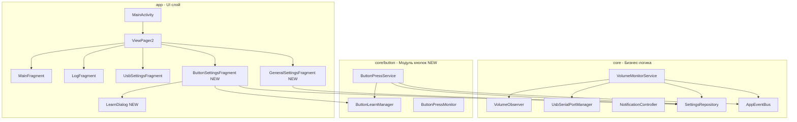
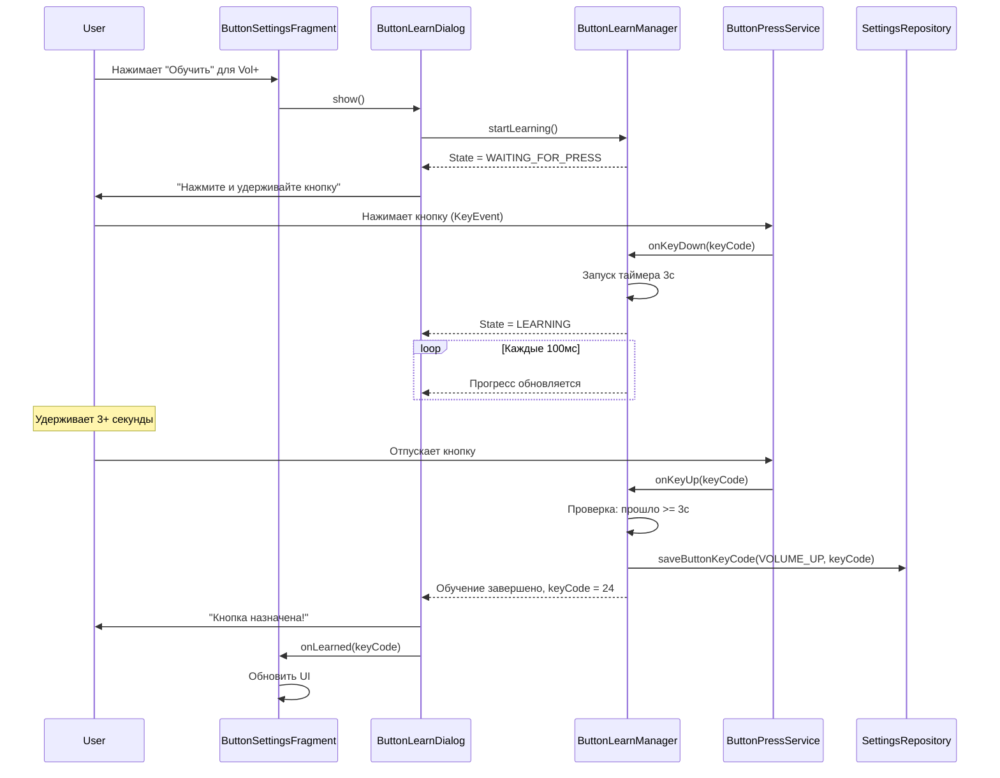

# План реализации: Управление громкостью через кнопки

## 1. Обзор

Добавление второго режима управления громкостью — через отслеживание нажатий физических кнопок устройства. Пользователь сможет выбрать между текущим режимом (отслеживание системной громкости) и новым режимом (кнопки). Все настройки сохраняются в долговременную память (SharedPreferences).

---

## 2. Архитектурная диаграмма



---

## 3. Перечень изменений

### 3.1. Модуль `core` — расширение

#### 3.1.1. Константы (`Constants.kt`)
Добавить ключи:
- `PREFS_NAME_GENERAL = "GeneralPrefs"`
- `KEY_VOLUME_CONTROL_MODE = "volume_control_mode"` — `"observer"` или `"buttons"`
- `PREFS_NAME_BUTTONS = "ButtonPrefs"`
- `KEY_BUTTON_VOLUME_UP = "button_volume_up"`
- `KEY_BUTTON_VOLUME_DOWN = "button_volume_down"`
- `KEY_MAX_VOLUME_VALUE = "max_volume_value"` — пользовательский максимум (15, 30, 40…), по умолчанию 15
- `KEY_BUTTON_CURRENT_VOLUME = "button_current_volume"` — текущая громкость в режиме кнопок
- `KEY_LONG_PRESS_DELAY_MS = "long_press_delay_ms"` — по умолчанию 500 мс
- `KEY_BUTTON_LEARN_TIMEOUT_MS = "button_learn_timeout_ms"` — по умолчанию 3000 мс

#### 3.1.2. Модель данных

**Новый файл: `core/src/.../core/model/ButtonAction.kt`**
```kotlin
enum class ButtonAction {
    VOLUME_UP,
    VOLUME_DOWN
}
```

**Новый файл: `core/src/.../core/model/VolumeControlMode.kt`**
```kotlin
enum class VolumeControlMode {
    OBSERVER,  // текущий режим — отслеживание системной громкости
    BUTTONS    // новый режим — отслеживание нажатий кнопок
}
```

#### 3.1.3. Расширение `SettingsRepository`

Добавить методы в интерфейс и реализацию:
- `getVolumeControlMode(): VolumeControlMode`
- `saveVolumeControlMode(mode: VolumeControlMode)`
- `getButtonKeyCode(action: ButtonAction): Int?`
- `saveButtonKeyCode(action: ButtonAction, keyCode: Int)`
- `getMaxVolumeValue(): Int` (пользовательский максимум: 15, 30, 40 и т.д.; по умолчанию 15)
- `saveMaxVolumeValue(value: Int)`
- `getLongPressDelayMs(): Long` (по умолчанию 500 мс)
- `saveLongPressDelayMs(delayMs: Long)`
- `getButtonCurrentVolume(): Int` (текущая громкость в режиме кнопок, 0..maxVolumeValue)
- `saveButtonCurrentVolume(volume: Int)`

#### 3.1.4. Расширение `AppEventBus`

Добавить новые события:
```kotlin
data class ButtonPressed(val action: ButtonAction) : AppEvent()
data class VolumeControlModeChanged(val mode: VolumeControlMode) : AppEvent()
```

#### 3.1.5. Общий модуль обучения кнопок

**Новый файл: `core/src/.../core/button/ButtonLearnManager.kt`**

Общий модуль, используемый как для Volume Up, так и для Volume Down (и потенциально других действий):

```kotlin
class ButtonLearnManager(
    private val context: Context,
    private val learnTimeoutMs: Long = 3000L
) {
    // Состояние обучения
    enum class State { IDLE, WAITING_FOR_PRESS, LEARNING }

    private val _state = MutableStateFlow(State.IDLE)
    val state: StateFlow<State> = _state.asStateFlow()

    private var learnedKeyCode: Int? = null
    private var learnStartTime: Long = 0L

    fun startLearning() { /* переходит в WAITING_FOR_PRESS */ }
    fun onKeyDown(keyCode: Int) { /* начинает отсчет 3 секунд */ }
    fun onKeyUp(keyCode: Int) { /* проверяет, прошло ли 3 секунды */ }
    fun cancelLearning() { /* сброс */ }
    fun getLearnedKeyCode(): Int? = learnedKeyCode
}
```

**Логика обучения:**
1. Вызывается `startLearning()` → состояние `WAITING_FOR_PRESS`
2. Пользователь нажимает кнопку → `onKeyDown()` → состояние `LEARNING`, запускается таймер
3. Если пользователь удерживает кнопку дольше `learnTimeoutMs` (3 сек) → кнопка выучена, `learnedKeyCode` заполняется
4. Если пользователь отпускает кнопку раньше → сброс, показать сообщение «Удерживайте дольше»
5. `cancelLearning()` — ручной сброс

#### 3.1.6. Сервис отслеживания кнопок

**Новый файл: `core/src/.../core/button/ButtonPressService.kt`**

`AccessibilityService` для перехвата KeyEvent в фоне:

```kotlin
class ButtonPressService : AccessibilityService() {
    private val settingsRepository: SettingsRepository by lazy { SettingsRepositoryImpl(this) }
    private var volumeUpKeyCode: Int? = null
    private var volumeDownKeyCode: Int? = null
    private var longPressDelayMs: Long = 500L

    // Отслеживание долгого нажатия
    private var activeKeyCode: Int? = null
    private var pressStartTime = 0L
    private var isLongPressActive = false
    private val repeatHandler = Handler(Looper.getMainLooper())
    private val repeatIntervalMs = 200L  // интервал автоповтора при долгом нажатии
    private var repeatRunnable: Runnable? = null

    override fun onKeyEvent(event: KeyEvent): Boolean {
        if (event.action == KeyEvent.ACTION_DOWN) {
            handleKeyDown(event.keyCode, event.repeatCount)
        } else if (event.action == KeyEvent.ACTION_UP) {
            handleKeyUp(event.keyCode)
        }
        return false
    }

    private fun handleKeyDown(keyCode: Int, repeatCount: Int) {
        // Игнорируем системный автоповтор (repeatCount > 0) — используем свой механизм
        if (repeatCount > 0) return
        val action = when (keyCode) {
            volumeUpKeyCode -> ButtonAction.VOLUME_UP
            volumeDownKeyCode -> ButtonAction.VOLUME_DOWN
            else -> return
        }
        activeKeyCode = keyCode
        pressStartTime = System.currentTimeMillis()
        isLongPressActive = false
        // Короткое нажатие — сразу ±1
        AppEventBus.tryEmit(AppEvent.ButtonPressed(action))
        // Планируем переход в режим долгого нажатия
        repeatRunnable?.let { repeatHandler.removeCallbacks(it) }
        val runnable = object : Runnable {
            override fun run() {
                if (activeKeyCode == keyCode) {
                    isLongPressActive = true
                    startLongPressRepeat(action)
                }
            }
        }
        repeatRunnable = runnable
        repeatHandler.postDelayed(runnable, longPressDelayMs)
    }

    private fun startLongPressRepeat(action: ButtonAction) {
        val runnable = object : Runnable {
            override fun run() {
                if (activeKeyCode != null && isLongPressActive) {
                    AppEventBus.tryEmit(AppEvent.ButtonPressed(action))
                    repeatHandler.postDelayed(this, repeatIntervalMs)
                }
            }
        }
        repeatRunnable = runnable
        repeatHandler.postDelayed(runnable, repeatIntervalMs)
    }

    private fun handleKeyUp(keyCode: Int) {
        if (keyCode == activeKeyCode) {
            activeKeyCode = null
            isLongPressActive = false
            repeatRunnable?.let { repeatHandler.removeCallbacks(it) }
            repeatRunnable = null
        }
    }

    override fun onServiceConnected() {
        reloadSettings()
    }

    fun reloadSettings() {
        volumeUpKeyCode = settingsRepository.getButtonKeyCode(ButtonAction.VOLUME_UP)
        volumeDownKeyCode = settingsRepository.getButtonKeyCode(ButtonAction.VOLUME_DOWN)
        longPressDelayMs = settingsRepository.getLongPressDelayMs()
    }
}
```

#### 3.1.7. Обработка нажатий в `VolumeMonitorService`

Добавить поле для хранения текущей громкости в режиме кнопок:

```kotlin
// Текущая громкость в режиме BUTTONS (0..maxVolumeValue)
private var buttonCurrentVolume: Int = 0
```

При старте сервиса восстановить сохраненное значение:
```kotlin
buttonCurrentVolume = settingsRepository.getButtonCurrentVolume()
```

В `VolumeMonitorService.onCreate()` добавить подписку на `ButtonPressed`:

```kotlin
serviceScope.launch {
    AppEventBus.events.collect { event ->
        if (event is AppEvent.ButtonPressed) {
            val mode = settingsRepository.getVolumeControlMode()
            if (mode == VolumeControlMode.BUTTONS) {
                handleButtonPress(event.action)
            }
        }
    }
}

private fun handleButtonPress(action: ButtonAction) {
    val maxVol = settingsRepository.getMaxVolumeValue()  // пользовательский макс (15, 30, 40...)
    val newVolume = when (action) {
        ButtonAction.VOLUME_UP -> (buttonCurrentVolume + 1).coerceIn(0, maxVol)
        ButtonAction.VOLUME_DOWN -> (buttonCurrentVolume - 1).coerceIn(0, maxVol)
    }
    if (newVolume != buttonCurrentVolume) {
        buttonCurrentVolume = newVolume
        settingsRepository.saveButtonCurrentVolume(buttonCurrentVolume)
        // Конвертация: из 0..maxVol в 0..255
        val portValue = (buttonCurrentVolume * 255.0 / maxVol).roundToInt().coerceIn(0, 255)
        sendVolumeData(portValue)
    }
}
```

**Формула конвертации:** `portValue = (buttonCurrentVolume × 255) / maxVolumeValue`
- Пример: max=15, current=7 → portValue = (7 × 255) / 15 = 119
- Пример: max=30, current=15 → portValue = (15 × 255) / 30 = 127
- Пример: max=40, current=40 → portValue = (40 × 255) / 40 = 255

---

### 3.2. Модуль `app` — UI

#### 3.2.1. Фрагмент «Общие настройки»

**Новый файл: `app/src/.../ui/GeneralSettingsFragment.kt`**

Содержит:
- RadioGroup / Switch для выбора режима управления:
  - «Отслеживание системной громкости» (текущий)
  - «Управление через кнопки» (новый)
- При переключении режима — сохранение в SharedPreferences
- Отправка события `VolumeControlModeChanged` через AppEventBus

**Новый файл: `app/src/.../res/layout/fragment_general_settings.xml`**

Макет с RadioGroup и пояснительным текстом.

#### 3.2.2. Фрагмент «Настройки кнопок»

**Новый файл: `app/src/.../ui/ButtonSettingsFragment.kt`**

Содержит:
1. **Секция «Громкость +»**:
   - Название назначенной кнопки (keyCode → читаемое имя)
   - Кнопка «Обучить»
   - Статус: «Не назначено» / «KeyCode: 24 (VOLUME_UP)»

2. **Секция «Громкость -»**:
   - Аналогично

3. **Поле ввода «Максимальное значение громкости»** (EditText, число, например 15, 30, 40):
   - Пользовательский максимум шкалы громкости (0…N)
   - В порт всегда отправляется значение 0…255 с пропорциональной конвертацией
   - По умолчанию: 15

4. **Поле ввода «Задержка долгого нажатия (мс)»** (EditText):
   - Для синхронизации с системой, значение в миллисекундах

5. **Кнопка «Сбросить все назначения»**

#### 3.2.3. Диалог обучения кнопки

**Новый файл: `app/src/.../ui/ButtonLearnDialog.kt`**

Модальное окно (DialogFragment):
- Текст: «Нажмите и удерживайте кнопку в течение 3 секунд»
- Прогресс-бар, заполняющийся в течение 3 секунд удержания
- При успешном обучении: показать «Кнопка назначена: KeyCode XXX»
- При отпускании раньше 3 секунд: «Удерживайте кнопку дольше»
- Кнопка «Отмена»

**Новый файл: `app/src/.../res/layout/dialog_button_learn.xml`**

Макет диалога:
- `TextView` с инструкцией
- `ProgressBar` (горизонтальный, determinate)
- `TextView` для отображения результата
- Кнопки «Отмена» / «OK»

#### 3.2.4. Обновление MainActivity

**Изменения в `MainActivity.kt`**:
- Увеличить `getItemCount()` с 3 до 5
- Добавить новые табы: «Общие» (позиция 2), «Кнопки» (позиция 3)
- Сдвинуть «USB» на позицию 4
- Обновить `offscreenPageLimit = 4`
- Обновить текст табов в `TabLayoutMediator`

#### 3.2.5. Макеты

**Новый файл: `app/src/.../res/layout/fragment_general_settings.xml`**

**Новый файл: `app/src/.../res/layout/fragment_button_settings.xml`**

**Новый файл: `app/src/.../res/layout/dialog_button_learn.xml`**

---

### 3.3. AndroidManifest

Добавить:
```xml
<service
    android:name="com.example.volumemonitor.core.button.ButtonPressService"
    android:exported="true"
    android:permission="android.permission.BIND_ACCESSIBILITY_SERVICE">
    <intent-filter>
        <action android:name="android.accessibilityservice.AccessibilityService" />
    </intent-filter>
    <meta-data
        android:name="android.accessibilityservice"
        android:resource="@xml/accessibility_service_config" />
</service>
```

**Новый файл: `app/src/main/res/xml/accessibility_service_config.xml`**

```xml
<accessibility-service
    xmlns:android="http://schemas.android.com/apk/res/android"
    android:accessibilityFeedbackType="feedbackGeneric"
    android:canRequestFilterKeyEvents="true"
    android:accessibilityFlags="flagDefault|flagRequestFilterKeyEvents"
    android:description="@string/accessibility_service_description" />
```

**Добавить строку в `strings.xml`:**
```xml
<string name="accessibility_service_description">
    Требуется для перехвата нажатий кнопок в фоновом режиме</string>
```

---

### 3.4. `core/build.gradle`

Убедиться, что зависимость от AndroidX core доступна (обычно через транзитивные зависимости). Минимальные изменения.

---

## 4. Поток обучения кнопки (Sequence Diagram)



---

## 5. Поток обработки нажатия в фоне

```mermaid
sequenceDiagram
    participant User
    participant BPS as ButtonPressService
    participant AEB as AppEventBus
    participant VMS as VolumeMonitorService
е    participant USB as UsbSerialPortManager

    Note over BPS: Сервис работает в фоне

    rect rgb(230, 255, 230)
        Note over User,BPS: Короткое нажатие
        User->>BPS: Нажимает кнопку Vol+
        BPS->>AEB: tryEmit ButtonPressed VOLUME_UP
        AEB->>VMS: buttonCurrentVolume +1
        VMS->>VMS: portValue = vol * 255 / max
        VMS->>USB: sendVolumeData portValue
    end

    rect rgb(255, 245, 230)
        Note over User,BPS: Долгое нажатие (удержание)
        User->>BPS: Нажимает и удерживает
        BPS->>AEB: tryEmit ButtonPressed VOLUME_UP
        AEB->>VMS: buttonCurrentVolume +1
        VMS->>VMS: portValue = vol * 255 / max
        VMS->>USB: sendVolumeData portValue
        Note over BPS: Через longPressDelayMs
        loop Каждые 200мс пока удерживает
            BPS->>AEB: tryEmit ButtonPressed VOLUME_UP
            AEB->>VMS: buttonCurrentVolume +1
            VMS->>VMS: portValue = vol * 255 / max
            VMS->>USB: sendVolumeData portValue
        end
        User->>BPS: Отпускает кнопку
        BPS->>BPS: Останавливает автоповтор
    end
```

---

## 6. Файловая структура (новые и изменяемые файлы)

### Новые файлы:

**core:**
- `core/src/main/java/com/example/volumemonitor/core/model/ButtonAction.kt`
- `core/src/main/java/com/example/volumemonitor/core/model/VolumeControlMode.kt`
- `core/src/main/java/com/example/volumemonitor/core/button/ButtonLearnManager.kt`
- `core/src/main/java/com/example/volumemonitor/core/button/ButtonPressService.kt`

**app:**
- `app/src/main/java/com/example/volumemonitor/ui/GeneralSettingsFragment.kt`
- `app/src/main/java/com/example/volumemonitor/ui/ButtonSettingsFragment.kt`
- `app/src/main/java/com/example/volumemonitor/ui/ButtonLearnDialog.kt`
- `app/src/main/res/layout/fragment_general_settings.xml`
- `app/src/main/res/layout/fragment_button_settings.xml`
- `app/src/main/res/layout/dialog_button_learn.xml`
- `app/src/main/res/xml/accessibility_service_config.xml`

### Изменяемые файлы:

- `core/src/main/java/com/example/volumemonitor/core/Constants.kt`
- `core/src/main/java/com/example/volumemonitor/core/event/AppEventBus.kt`
- `core/src/main/java/com/example/volumemonitor/core/repository/SettingsRepository.kt`
- `core/src/main/java/com/example/volumemonitor/core/repository/SettingsRepositoryImpl.kt`
- `core/src/main/java/com/example/volumemonitor/core/VolumeMonitorService.kt`
- `app/src/main/java/com/example/volumemonitor/MainActivity.kt`
- `app/src/main/AndroidManifest.xml`
- `app/src/main/res/values/strings.xml`

---

## 7. Промпт для реализации

> Реализуй второй вариант управления громкостью через отслеживание нажатий кнопок согласно плану в [`plans/button-control-plan.md`](plans/button-control-plan.md).
>
> **Основные шаги:**
>
> 1. Добавь новые константы в [`Constants.kt`](core/src/main/java/com/example/volumemonitor/core/Constants.kt): ключи SharedPreferences для общих настроек и настроек кнопок.
>
> 2. Создай enum-классы [`ButtonAction.kt`](core/src/main/java/com/example/volumemonitor/core/model/ButtonAction.kt) (VOLUME_UP, VOLUME_DOWN) и [`VolumeControlMode.kt`](core/src/main/java/com/example/volumemonitor/core/model/VolumeControlMode.kt) (OBSERVER, BUTTONS).
>
> 3. Расширь [`SettingsRepository.kt`](core/src/main/java/com/example/volumemonitor/core/repository/SettingsRepository.kt) и [`SettingsRepositoryImpl.kt`](core/src/main/java/com/example/volumemonitor/core/repository/SettingsRepositoryImpl.kt): добавь методы для режима управления, keyCode кнопок, максимального значения громкости (пользовательский максимум: 15, 30, 40…), задержки долгого нажатия, текущей громкости в режиме кнопок. Используй отдельные SharedPreferences файлы (`GeneralPrefs` и `ButtonPrefs`).
>
> 4. Расширь [`AppEventBus.kt`](core/src/main/java/com/example/volumemonitor/core/event/AppEventBus.kt): добавь события `ButtonPressed(action: ButtonAction)` и `VolumeControlModeChanged(mode: VolumeControlMode)`.
>
> 5. Создай [`ButtonLearnManager.kt`](core/src/main/java/com/example/volumemonitor/core/button/ButtonLearnManager.kt) — общий модуль обучения кнопок. Логика: вызов `startLearning()`, ожидание KeyEvent, отсчет 3 секунд удержания, сохранение keyCode при успехе. Используй `MutableStateFlow<State>` для реактивного обновления UI (состояния: IDLE, WAITING_FOR_PRESS, LEARNING, LEARNED).
>
> 6. Создай [`ButtonPressService.kt`](core/src/main/java/com/example/volumemonitor/core/button/ButtonPressService.kt) — AccessibilityService для перехвата KeyEvent в фоне. Загружает назначенные keyCode из SettingsRepository. Логика: при нажатии сразу эмитит `ButtonPressed` (+1 к громкости). Если кнопка удерживается дольше `longPressDelayMs` — запускает автоповтор каждые 200 мс (непрерывное изменение). При отпускании останавливает автоповтор. Игнорирует системный repeatCount. ВАЖНО: возвращает `false` из `onKeyEvent`, чтобы не блокировать системную обработку кнопок.
>
> 7. Обнови [`VolumeMonitorService.kt`](core/src/main/java/com/example/volumemonitor/core/VolumeMonitorService.kt):
>     - Добавь поле `buttonCurrentVolume` (текущая громкость в режиме BUTTONS, 0..maxVolumeValue)
>     - При старте восстанавливай `buttonCurrentVolume` из SettingsRepository
>     - Добавь подписку на `ButtonPressed`: ±1 к `buttonCurrentVolume`, сохраняй в SharedPreferences
>     - Конвертируй в порт: `portValue = (buttonCurrentVolume * 255.0 / maxVol).roundToInt().coerceIn(0, 255)`
>     - Вызывай `sendVolumeData(portValue)`
>
> 8. Создай [`GeneralSettingsFragment.kt`](app/src/main/java/com/example/volumemonitor/ui/GeneralSettingsFragment.kt) с RadioGroup для выбора режима управления (OBSERVER / BUTTONS). При переключении сохраняй в SettingsRepository.
>
> 9. Создай макет [`fragment_general_settings.xml`](app/src/main/res/layout/fragment_general_settings.xml).
>
> 10. Создай [`ButtonSettingsFragment.kt`](app/src/main/java/com/example/volumemonitor/ui/ButtonSettingsFragment.kt):
>     - Отображение назначенных кнопок для Vol+ и Vol- (keyCode → читаемое имя)
>     - Кнопки «Обучить» для каждого действия → открывают ButtonLearnDialog
>     - EditText для максимального значения громкости (пользовательский максимум: 15, 30, 40…; в порт конвертируется в 0–255)
>     - EditText для задержки долгого нажатия в миллисекундах
>     - Кнопка «Сбросить все назначения»
>     - При изменении значений — сохранение в SettingsRepository
>
> 11. Создай макет [`fragment_button_settings.xml`](app/src/main/res/layout/fragment_button_settings.xml).
>
> 12. Создай [`ButtonLearnDialog.kt`](app/src/main/java/com/example/volumemonitor/ui/ButtonLearnDialog.kt) — DialogFragment:
>     - Текст «Нажмите и удерживайте кнопку в течение 3 секунд»
>     - ProgressBar (горизонтальный, заполняется за 3 секунды)
>     - При успехе: «Кнопка назначена: KeyCode XXX», кнопка «OK»
>     - При неудаче: «Удерживайте кнопку дольше», кнопка «Повторить»
>     - Использует ButtonLearnManager для логики обучения
>
> 13. Создай макет [`dialog_button_learn.xml`](app/src/main/res/layout/dialog_button_learn.xml).
>
> 14. Обнови [`MainActivity.kt`](app/src/main/java/com/example/volumemonitor/MainActivity.kt): добавь 2 новых таба («Общие» и «Кнопки»), увеличь `offscreenPageLimit` до 4, обнови `TabLayoutMediator`.
>
> 15. Обнови [`AndroidManifest.xml`](app/src/main/AndroidManifest.xml): добавь AccessibilityService.
>
> 16. Создай [`accessibility_service_config.xml`](app/src/main/res/xml/accessibility_service_config.xml).
>
> 17. Добавь строку описания AccessibilityService в [`strings.xml`](app/src/main/res/values/strings.xml).
>
> **Важные требования:**
> - Не повышай compileSdk (оставайся на 33) и minSdk (18).
> - Сохраняй существующий стиль кода (русские комментарии, именование, организация пакетов).
> - Все настройки сохраняются через SharedPreferences.
> - Используй иммутабельные состояния, StateFlow/SharedFlow.
> - AccessibilityService должен возвращать `false` из `onKeyEvent`, чтобы не блокировать другие приложения.
> - В макетах используй тему приложения и Material Design (уже подключен).

---

## 8. Принятые решения (согласовано)

1. **Порядок табов**: «Главная» (0), «Лог» (1), «Общие» (2), «Кнопки» (3), «USB» (4).

2. **Модель громкости в режиме BUTTONS**:
   - Пользователь задает `maxVolumeValue` (например, 15, 30, 40) — это его шкала
   - Внутреннее состояние `buttonCurrentVolume` хранится от 0 до `maxVolumeValue`
   - Каждое нажатие: ±1 в пределах [0, maxVolumeValue]
   - При отправке в порт: `portValue = (buttonCurrentVolume × 255) / maxVolumeValue` (всегда 0…255)
   - `buttonCurrentVolume` сохраняется в SharedPreferences и восстанавливается при старте

3. **Шаг громкости**: всегда ±1. Короткое нажатие = одно событие ButtonPressed. Долгое нажатие = автоповтор ButtonPressed каждые 200 мс, пока кнопка удерживается.

3. **Только Vol+ и Vol-**: обучение для кнопок смены пресета не добавляется.

4. **Задержка долгого нажатия**: настраивается пользователем в миллисекундах (поле ввода в ButtonSettingsFragment). По умолчанию 500 мс. Это порог, после которого начинается автоповтор.

5. **AccessibilityService**: Пользователю потребуется включить службу в Настройки → Специальные возможности. В UI нужна проверка статуса и кнопка перехода в настройки.

6. **Отображение имени кнопки**: KeyCode → читаемое имя через `KeyEvent.keyCodeToString(keyCode)` (API 29+), с fallback-маппингом для старых API.
