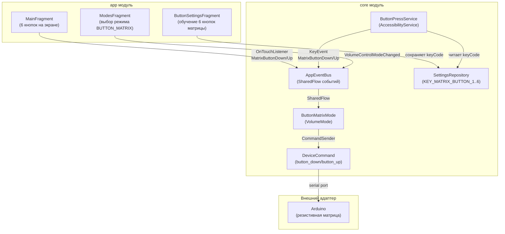

# План реализации режима "Матрица кнопок" (Button Matrix)

## Концепция

Новый режим `BUTTON_MATRIX`, в котором на внешнем адаптере из схемы исключается потенциометр, а вместо него включается резистивная матрица из 6 кнопок. Приложение отправляет команды `button_down` / `button_up` с номером кнопки (1-6) при нажатии/отпускании.

На главном экране отображается блок из 6 программных кнопок. Также есть возможность обучить физические кнопки (через AccessibilityService) для каждой из 6 позиций матрицы.

---

## Архитектурная схема



---

## Список изменений по файлам

### 1. `core/src/main/java/com/example/volumemonitor/core/model/VolumeControlMode.kt`
- Добавить значение `BUTTON_MATRIX` в enum

### 2. `core/src/main/java/com/example/volumemonitor/core/model/DeviceCommand.kt`
- Добавить два новых подкласса:
  - `data class ButtonDown(val value: Int) : DeviceCommand()` — `{"command":"button_down","value":N}`
  - `data class ButtonUp(val value: Int) : DeviceCommand()` — `{"command":"button_up","value":N}`
- Валидация: `value in 1..6`

### 3. `core/src/main/java/com/example/volumemonitor/core/event/AppEventBus.kt`
- Добавить события:
  - `data class MatrixButtonDown(val buttonNumber: Int) : AppEvent()` — номер кнопки 1..6
  - `data class MatrixButtonUp(val buttonNumber: Int) : AppEvent()` — номер кнопки 1..6

### 4. `core/src/main/java/com/example/volumemonitor/core/Constants.kt`
- Добавить константы:
  - `const val PREFS_NAME_MATRIX = "MatrixButtonPrefs"`
  - `const val KEY_MATRIX_BUTTON_1 = "matrix_button_1"` ... `KEY_MATRIX_BUTTON_6 = "matrix_button_6"`
  - `const val MATRIX_BUTTON_COUNT = 6`

### 5. `core/src/main/java/com/example/volumemonitor/core/repository/SettingsRepository.kt`
- Добавить методы:
  - `fun getMatrixButtonKeyCodes(buttonNumber: Int): Set<Int>` (buttonNumber: 1..6)
  - `fun addMatrixButtonKeyCode(buttonNumber: Int, keyCode: Int)`
  - `fun removeMatrixButtonKeyCode(buttonNumber: Int, keyCode: Int)`
  - `fun removeAllMatrixButtonKeyCodes(buttonNumber: Int)`

### 6. `core/src/main/java/com/example/volumemonitor/core/repository/SettingsRepositoryImpl.kt`
- Имплементировать новые методы с хранением в `matrixPrefs` (SharedPreferences `PREFS_NAME_MATRIX`)
- Использовать `StringSet` для хранения множества keyCode на каждую кнопку

### 7. `core/src/main/java/com/example/volumemonitor/core/volume/mode/ButtonMatrixMode.kt` (НОВЫЙ ФАЙЛ)
- `class ButtonMatrixMode` extends `VolumeMode`
- `modeId = VolumeControlMode.BUTTON_MATRIX`
- `displayName = "Матрица кнопок"`
- `description = "Управление через матрицу из 6 кнопок. Отправка button_down/button_up с номером кнопки."`
- `start()`: подписка на `AppEvent.MatrixButtonDown` и `AppEvent.MatrixButtonUp`
- Обработчик `MatrixButtonDown`: `commandSender.send(DeviceCommand.ButtonDown(buttonNumber))`
- Обработчик `MatrixButtonUp`: `commandSender.send(DeviceCommand.ButtonUp(buttonNumber))`
- `ModeState`: displayLabel = "матрица", currentVolume = 0, maxVolume = 0 (режим без громкости)
- `onUsbConnected()`: не требует действий

### 8. `core/src/main/java/com/example/volumemonitor/core/VolumeMonitorService.kt`
- В методе `activateMode()` добавить ветку:
  ```kotlin
  VolumeControlMode.BUTTON_MATRIX -> ButtonMatrixMode(
      context = this,
      commandSender = commandSender,
      settingsRepository = settingsRepository,
      appEvents = AppEventBus.events
  )
  ```

### 9. `core/src/main/java/com/example/volumemonitor/core/button/ButtonPressService.kt`
- Загружать keyCode для 6 кнопок матрицы из `SettingsRepository`
- В `handleKeyDown` / `handleKeyUp`: проверять keyCode на принадлежность к кнопкам матрицы (1..6)
- При нажатии: `AppEventBus.tryEmit(AppEvent.MatrixButtonDown(buttonNumber))`
- При отпускании: `AppEventBus.tryEmit(AppEvent.MatrixButtonUp(buttonNumber))`
- **Важно**: кнопки матрицы не должны конфликтовать с VOLUME_UP/VOLUME_DOWN (один keyCode может быть назначен только на одно действие)
- Для матрицы не нужен автоповтор (long press), только одиночные нажатия/отпускания

### 10. `app/src/main/java/com/example/volumemonitor/ui/ButtonSettingsFragment.kt`
- Добавить секцию "Матрица кнопок" с 6 строками:
  - Каждая строка: `"Кнопка 1" [keyCode список] [Обучить] [✕]`
- Кнопка "Обучить" — вызывает `showLearnDialog()` с новым типом действия (передать `buttonNumber`)
- **Важно**: текущий `ButtonLearnDialog` принимает `ButtonAction`. Нужно либо расширить его для поддержки номера кнопки, либо создать перегрузку.
- Рекомендуется: добавить в `ButtonLearnDialog` второй фабричный метод `newInstance(buttonNumber: Int)` для матрицы

### 11. `app/src/main/java/com/example/volumemonitor/ui/ButtonLearnDialog.kt`
- Добавить поддержку режима матрицы (аргумент `buttonNumber` вместо `action`)
- В колбэке `setOnLearnListener` для матрицы передавать `(keyCode: Int) -> Unit` и в `ButtonSettingsFragment` вызывать `settingsRepository.addMatrixButtonKeyCode(buttonNumber, keyCode)`

### 12. `app/src/main/res/layout/fragment_main.xml`
- Добавить блок `matrixButtonsLayout` (LinearLayout, visibility="gone"):
  - Заголовок "Матрица кнопок"
  - Сетка из 6 кнопок (2 ряда × 3 столбца или 3 ряда × 2 столбца)
  - Каждая кнопка: `android:text="1"` .. `"6"`, `id=matrixButton1` .. `matrixButton6`

### 13. `app/src/main/java/com/example/volumemonitor/ui/MainFragment.kt`
- Привязать view для 6 кнопок матрицы
- В обработчике `AppEvent.ModeStateChanged`: показывать `matrixButtonsLayout` когда `modeId == BUTTON_MATRIX`
- Для каждой кнопки установить `OnTouchListener`:
  - `MotionEvent.ACTION_DOWN` → эмитить `AppEvent.MatrixButtonDown(N)`
  - `MotionEvent.ACTION_UP` / `ACTION_CANCEL` → эмитить `AppEvent.MatrixButtonUp(N)`
- В `refreshVolumeDisplay()`: добавить ветку для `BUTTON_MATRIX` — показывать статичный текст (например, "Режим матрицы кнопок")

### 14. `app/src/main/res/layout/fragment_modes.xml`
- Добавить `RadioButton` с id `radioButtonMatrix` и текстом "Матрица кнопок (6 кнопок)"

### 15. `app/src/main/java/com/example/volumemonitor/ui/ModesFragment.kt`
- Добавить обработку `R.id.radioButtonMatrix` → `VolumeControlMode.BUTTON_MATRIX`
- В `updateModeDescription`: добавить описание для BUTTON_MATRIX
- Скрывать `observerMaxSettingsLayout` и `buttonMaxVolumeSettingsLayout` при выборе BUTTON_MATRIX

### 16. Тесты
- `core/src/test/.../model/ModelsTest.kt`: тесты для `ButtonDown`/`ButtonUp` (валидация, toJson)
- `core/src/test/.../serialization/JsonCommandSerializerTest.kt`: тесты JSON-сериализации новых команд
- При желании: тест для `ButtonMatrixMode`

---

## Wire-формат команд

```
Отправка в порт (нажатие кнопки 3):
[{"command":"button_down","value":3}]\n

Отправка в порт (отпускание кнопки 3):
[{"command":"button_up","value":3}]\n
```

Фреймирование `[json]\n` — как у всех существующих команд через `DeviceCommand.frame()`.

---

## Подтверждённые решения

| Вопрос | Решение |
|--------|---------|
| Wire-формат | `{"command":"button_down","value":N}` / `{"command":"button_up","value":N}` ✅ |
| Нумерация кнопок | 1..6 ✅ |
| Отображение громкости | Не показывать. На главном экране — только блок кнопок матрицы. `ModeState` с displayLabel="матрица", currentVolume=0, maxVolume=0. ✅ |
| Одновременные нажатия | Не поддерживать. Каждая кнопка — независимая обработка DOWN/UP. Автоповтор (long press) не нужен. ✅ |
