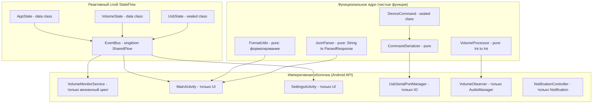
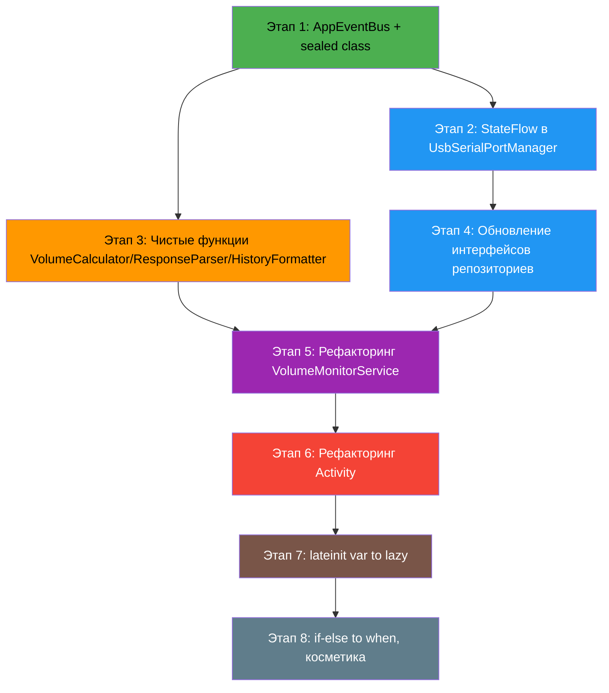

# План переписывания VolumeMonitor в функциональном стиле

> **Контекст:** Android-приложение на Kotlin для мониторинга громкости и отправки данных на Arduino через USB Serial. Проект уже прошел частичный SOLID-рефакторинг (выделены интерфейсы репозиториев, [`DeviceCommand`](core/src/main/java/com/example/volumemonitor/core/model/DeviceCommand.kt), [`CommandSerializer`](core/src/main/java/com/example/volumemonitor/core/serialization/CommandSerializer.kt), вынесены [`UsbSerialPortManager`](core/src/main/java/com/example/volumemonitor/core/usb/UsbSerialPortManager.kt), [`VolumeObserver`](core/src/main/java/com/example/volumemonitor/core/volume/VolumeObserver.kt) и [`NotificationController`](core/src/main/java/com/example/volumemonitor/core/notification/NotificationController.kt)).
>
> **Цель:** Переписать оставшийся код в соответствии с принципами функционального программирования (ФП), сохраняя совместимость с Android API и ограничением `compileSdk 33` / `minSdk 18`.

---

## 1. Что такое «функциональный стиль» в контексте этого проекта

| Принцип ФП | Проявление в Kotlin/Android | Цель |
|---|---|---|
| **Иммутабельность** | `val` вместо `var`, `data class` вместо изменяемых POJO, `copy()` для «изменения» | Нет неожиданных мутаций состояния |
| **Чистые функции** | Функции без побочных эффектов, зависящие только от аргументов | Тестируемость, предсказуемость |
| **Функции высшего порядка** | Лямбды, `(A) -> B`, композиция через `.let/.run/.also` | Композиция вместо наследования |
| **Алгебраические типы данных** | `sealed class` для состояний/результатов вместо `Boolean` + `null` | Типобезопасность, исчерпывающий `when` |
| **Реактивность** | `StateFlow`/`SharedFlow` вместо `BroadcastReceiver` и колбэков | Единый поток данных |
| **Функциональная обработка коллекций** | `.map`, `.filter`, `.fold`, `.firstOrNull` вместо `for` + `var` | Декларативность |
| **Отказ от `lateinit var`** | `lazy`, фабричные функции, `by lazy` | Инициализация гарантирована компилятором |

---

## 2. Анализ текущего кода: что уже в ФП-стиле, а что нет

### 2.1 Уже хорошо (сохраняем)

| Файл | Что в ФП-стиле |
|---|---|
| [`DeviceCommand.kt`](core/src/main/java/com/example/volumemonitor/core/model/DeviceCommand.kt) | `sealed class` — идеальный алгебраический тип |
| [`CommandSerializer.kt`](core/src/main/java/com/example/volumemonitor/core/serialization/CommandSerializer.kt) | `when` как выражение, интерфейс с чистыми функциями |
| [`Constants.kt`](core/src/main/java/com/example/volumemonitor/core/Constants.kt) | `object` с константами — ок |
| [`UsbDeviceHelper.kt`](app/src/main/java/com/example/volumemonitor/util/UsbDeviceHelper.kt) | `object` с единственной `fun` — чистая утилита |
| Интерфейсы репозиториев | Функции высшего порядка (`listener: (String) -> Unit`) |

### 2.2 Требуют переработки (антипаттерны)

| Файл | Проблема |
|---|---|
| [`VolumeMonitorService.kt`](core/src/main/java/com/example/volumemonitor/core/VolumeMonitorService.kt) | 3 `lateinit var`, 2 `var` поля мутабельного состояния, императивная сборка в `onCreate()` |
| [`MainActivity.kt`](app/src/main/java/com/example/volumemonitor/MainActivity.kt) | 4 `var` мутабельных поля, `StringBuilder` для истории, 3 анонимных `BroadcastReceiver`, `var` для `lastSentBassLevel`, ручное управление `Runnable` |
| [`SettingsActivity.kt`](app/src/main/java/com/example/volumemonitor/SettingsActivity.kt) | 3 `var` мутабельных поля, `MutableList<UsbDevice>`, дублирование `startAndBindService()` |
| [`UsbSerialPortManager.kt`](core/src/main/java/com/example/volumemonitor/core/usb/UsbSerialPortManager.kt) | 2 `var` для состояния, `StringBuilder` с `synchronized`, nullable-колбэки вместо Flow |
| [`VolumeObserver.kt`](core/src/main/java/com/example/volumemonitor/core/volume/VolumeObserver.kt) | `var` для `previousVolume` и nullable-колбэка |
| [`NotificationController.kt`](core/src/main/java/com/example/volumemonitor/core/notification/NotificationController.kt) | `var pendingIntent` |
| [`ServiceBindHelper.kt`](app/src/main/java/com/example/volumemonitor/util/ServiceBindHelper.kt) | `var volumeService`, `var isBound` |
| [`BootReceiver.kt`](app/src/main/java/com/example/volumemonitor/BootReceiver.kt) | `if-else` вместо `when`, но тривиален |

---

## 3. Целевая архитектура (функциональное ядро + императивная оболочка)



---

## 4. План переработки по этапам

### Этап 1: Внедрение StateFlow — замена BroadcastReceiver и колбэков

**Цель:** Уничтожить «broadcast-спагетти» (4 action-строки), заменив их на типизированный `SharedFlow`/`StateFlow` в рамках одного процесса.

#### Шаг 1.1 — Создать `AppEventBus` (синглтон-шина событий)

**Новый файл:** `core/src/main/java/com/example/volumemonitor/core/event/AppEventBus.kt`

```kotlin
// Единая шина событий вместо 4 BroadcastReceiver action-строк
object AppEventBus {
    private val _events = MutableSharedFlow<AppEvent>(extraBufferCapacity = 16)
    val events: SharedFlow<AppEvent> = _events.asSharedFlow()

    suspend fun emit(event: AppEvent) { _events.emit(event) }
    fun tryEmit(event: AppEvent) { _events.tryEmit(event) }
}

sealed class AppEvent {
    data class VolumeChanged(val current: Int, val target: Int) : AppEvent()
    data class UsbStatusChanged(val status: UsbStatus) : AppEvent()
    data class ArduinoResponse(val rawLine: String) : AppEvent()
}

sealed class UsbStatus {
    object Initializing : UsbStatus()
    data class Connected(val deviceName: String) : UsbStatus()
    data class Error(val message: String) : UsbStatus()
    object Disconnected : UsbStatus()
}
```

#### Шаг 1.2 — Рефакторинг [`VolumeMonitorService`](core/src/main/java/com/example/volumemonitor/core/VolumeMonitorService.kt)

Убрать `sendBroadcast()` и заменить на `AppEventBus.tryEmit()`:

```kotlin
// Было:
val intent = Intent(Constants.ACTION_VOLUME_UPDATED)
intent.putExtra("volume", current)
sendBroadcast(intent)

// Стало:
AppEventBus.tryEmit(AppEvent.VolumeChanged(current, volumeObserver.targetVolume))
```

#### Шаг 1.3 — Рефакторинг Activity: замена 3 BroadcastReceiver на collection Flow

Вместо трех `BroadcastReceiver` в [`MainActivity`](app/src/main/java/com/example/volumemonitor/MainActivity.kt) — один сборщик `AppEventBus.events`:

```kotlin
// В onCreate:
lifecycleScope.launch {
    AppEventBus.events.collect { event ->
        when (event) {
            is AppEvent.VolumeChanged -> updateVolumeDisplay(event.current, event.target)
            is AppEvent.UsbStatusChanged -> updateUsbStatus(event.status)
            is AppEvent.ArduinoResponse -> processArduinoResponse(event.rawLine)
        }
    }
}
```

Удаляются: `volumeUpdateReceiver`, `usbStatusReceiver`, `arduinoResponseReceiver` (3 анонимных класса), методы `registerReceivers()`, все `unregisterReceiver()`.

---

### Этап 2: Иммутабельные модели состояний (Sealed Class)

**Цель:** Заменить `var isConnected: Boolean` + `var status: String` + nullable-колбэки на один `StateFlow<SealedClass>`.

#### Шаг 2.1 — Рефакторинг [`UsbSerialPortManager`](core/src/main/java/com/example/volumemonitor/core/usb/UsbSerialPortManager.kt)

```kotlin
// Было (3 var поля + 2 nullable колбэка):
var isConnected: Boolean = false
var status: String = "Инициализация..."
private var dataListener: ((String) -> Unit)? = null
private var errorListener: ((String) -> Unit)? = null

// Стало (один StateFlow):
private val _state = MutableStateFlow<UsbPortState>(UsbPortState.Disconnected)
val state: StateFlow<UsbPortState> = _state.asStateFlow()

sealed class UsbPortState {
    object Disconnected : UsbPortState()
    object Initializing : UsbPortState()
    data class Connected(val deviceName: String) : UsbPortState()
    data class Error(val message: String) : UsbPortState()
}
```

Методы `connect()`, `disconnect()` обновляют `_state` вместо мутации отдельных `var`.

#### Шаг 2.2 — Рефакторинг [`UsbRepository`](core/src/main/java/com/example/volumemonitor/core/repository/UsbRepository.kt)

```kotlin
// Было:
val isConnected: Boolean
val status: String
fun setDataListener(listener: (String) -> Unit)
fun setErrorListener(listener: (String) -> Unit)

// Стало:
val portState: StateFlow<UsbPortState>
val dataFlow: SharedFlow<String>        // входящие данные от Arduino
```

#### Шаг 2.3 — Рефакторинг [`UsbRepositoryImpl`](core/src/main/java/com/example/volumemonitor/core/repository/UsbRepositoryImpl.kt)

Делегирует `portState` и `dataFlow` из `UsbSerialPortManager`.

---

### Этап 3: Чистые функции — выделение бизнес-логики без побочных эффектов

**Цель:** Изолировать чистую логику преобразования данных в отдельные файлы/объекты.

#### Шаг 3.1 — [`VolumeCalculator`](core/src/main/java/com/example/volumemonitor/core/volume/VolumeObserver.kt) — уже частично сделан

Метод `targetVolume` уже является чистым вычислением. Вынести в отдельный объект:

```kotlin
object VolumeCalculator {
    fun toTarget(current: Int): Int = if (current == 0) 0
        else (current * Constants.MAX_VOLUME_TARGET.toDouble() / Constants.MAX_VOLUME_SOURCE)
            .roundToInt()
            .coerceIn(0, Constants.MAX_VOLUME_TARGET)

    fun bassPositionToValue(position: Int): Int {
        val percent = (position * 100f / Constants.BASS_MAX_POSITION).roundToInt()
        return (percent * Constants.MAX_VOLUME_TARGET / 100f).roundToInt().coerceIn(0, Constants.MAX_VOLUME_TARGET)
    }

    fun bassPositionToPercent(position: Int): Int =
        (position * 100f / Constants.BASS_MAX_POSITION).roundToInt()
}
```

Устраняет дублирование формулы `current * 255.0 / 30.0` из 3 мест.

#### Шаг 3.2 — [`ResponseParser`](core/src/main/java/com/example/volumemonitor/core/parser/ResponseParser.kt)

Вынести логику парсинга JSON-ответа Arduino в чистую функцию:

```kotlin
object ResponseParser {
    fun parse(raw: String): ParsedResponse = try {
        val json = JSONObject(raw.trim().removeSurrounding("[", "]"))
        when (json.optString("command")) {
            "preset_changed" -> ParsedResponse.PresetChanged(json.optInt("value", -1))
            else -> ParsedResponse.Unknown(raw)
        }
    } catch (e: Exception) {
        ParsedResponse.NotJson(raw)
    }
}

sealed class ParsedResponse {
    data class PresetChanged(val value: Int) : ParsedResponse()
    data class Unknown(val raw: String) : ParsedResponse()
    data class NotJson(val raw: String) : ParsedResponse()
}
```

Выносится из [`arduinoResponseReceiver`](app/src/main/java/com/example/volumemonitor/MainActivity.kt:100-149).

#### Шаг 3.3 — [`ResponseHistoryFormatter`](core/src/main/java/com/example/volumemonitor/core/format/ResponseHistoryFormatter.kt)

Вынести логику накопления истории ответов:

```kotlin
object ResponseHistoryFormatter {
    fun addResponse(history: List<String>, raw: String, maxLines: Int = 10): List<String> {
        val timestamp = SimpleDateFormat("HH:mm:ss", Locale.getDefault()).format(Date())
        val formatted = "[$timestamp] $raw"
        return listOf(formatted) + history.take(maxLines - 1)
    }

    fun format(history: List<String>): String = history.joinToString("\n")
}
```

Вместо мутабельного `StringBuilder responseHistory` в Activity — иммутабельный `List<String>` в StateFlow.

---

### Этап 4: Рефакторинг Activity до «глупого» UI

**Цель:** Activity содержит только `findViewById`, установку `OnClickListener` и подписку на `StateFlow`. Вся логика — в чистых функциях и ViewModel (опционально).

#### Шаг 4.1 — Рефакторинг [`MainActivity`](app/src/main/java/com/example/volumemonitor/MainActivity.kt)

| Было | Стало |
|---|---|
| `var currentPreset: Int? = 1` | `val currentPreset = MutableStateFlow(1)` |
| `var lastSentBassLevel: Int? = null` | Убрать, проверять через `.distinctUntilChanged()` |
| `val responseHistory = StringBuilder()` | `val responseHistory = MutableStateFlow<List<String>>(emptyList())` |
| 3 `BroadcastReceiver` | 1 `lifecycleScope.launch { AppEventBus.events.collect {} }` |
| `var volumeService: VolumeMonitorService?` | `val serviceState = MutableStateFlow<ServiceState>()` |
| `var isBound = false` | Поглощается `ServiceState` |
| `loadBassLevel()` / `saveBassLevel()` | Делегировать в `SettingsRepository` |
| `startAndBindService()` | `ServiceBindHelper` (уже создан) |

#### Шаг 4.2 — Рефакторинг [`SettingsActivity`](app/src/main/java/com/example/volumemonitor/SettingsActivity.kt)

| Было | Стало |
|---|---|
| `val connectedUsbDevices: MutableList<UsbDevice> = ArrayList()` | `val devices = MutableStateFlow<List<UsbDevice>>(emptyList())` |
| `var selectedUsbDevice: UsbDevice? = null` | `val selectedDevice = MutableStateFlow<UsbDevice?>(null)` |
| `var volumeService: VolumeMonitorService?` | `val serviceState = MutableStateFlow<ServiceState>()` |
| `BroadcastReceiver usbReceiver` | Подписка на `AppEventBus.events` |
| `saveSelectedUsbDevice()` | Делегировать в `SettingsRepository` |

---

### Этап 5: Рефакторинг [`VolumeMonitorService`](core/src/main/java/com/example/volumemonitor/core/VolumeMonitorService.kt)

**Цель:** Service становится «координатором жизненного цикла» без мутабельного состояния:

```kotlin
class VolumeMonitorService : Service() {

    // Все зависимости внедряются через фабричную функцию (DI вручную)
    private lateinit var portManager: UsbSerialPortManager
    private lateinit var volumeObserver: VolumeObserver
    private lateinit var notificationController: NotificationController
    private lateinit var settingsRepository: SettingsRepository

    // Композиция потоков данных (реактивная координация)
    private val serviceScope = CoroutineScope(Dispatchers.Default + SupervisorJob())

    override fun onCreate() {
        super.onCreate()
        // Инициализация компонентов
        portManager = UsbSerialPortManager(this, getSystemService(USB_SERVICE) as UsbManager)
        volumeObserver = VolumeObserver(this, getSystemService(AUDIO_SERVICE) as AudioManager)
        notificationController = NotificationController(this)
        settingsRepository = SettingsRepositoryImpl(this)

        // Реактивное связывание (вместо ручных колбэков):
        serviceScope.launch {
            // Громкость → отправить на Arduino
            volumeObserver.volume.collect { vol ->
                AppEventBus.tryEmit(AppEvent.VolumeChanged(vol.current, vol.target))
                val cmd = DeviceCommand.SetVolume(vol.target)
                val framed = JsonCommandSerializer().frame(JsonCommandSerializer().serialize(cmd))
                portManager.send(framed)
            }
        }
        serviceScope.launch {
            // Данные от Arduino → broadcast в AppEventBus
            portManager.dataFlow.collect { line ->
                AppEventBus.tryEmit(AppEvent.ArduinoResponse(line))
            }
        }
        serviceScope.launch {
            // Статус USB → broadcast
            portManager.state.collect { state ->
                AppEventBus.tryEmit(AppEvent.UsbStatusChanged(/* map state */))
            }
        }

        // Регистрация receiver-ов (остается, т.к. требует Context)
        registerUsbReceiver()
        volumeObserver.register()

        startForeground(Constants.NOTIFICATION_ID, notificationController.build())

        // Авто-подключение
        autoConnectSavedDevice()
    }

    override fun onDestroy() {
        serviceScope.cancel()
        volumeObserver.unregister()
        portManager.disconnect()
        super.onDestroy()
    }
}
```

---

### Этап 6: Устранение `lateinit var` через `lazy`

**Цель:** Гарантировать инициализацию на уровне компиляции, а не рантайма.

| Файл | Было | Стало |
|---|---|---|
| [`VolumeMonitorService`](core/src/main/java/com/example/volumemonitor/core/VolumeMonitorService.kt) | `private lateinit var audioManager: AudioManager` | `private val audioManager by lazy { getSystemService(AUDIO_SERVICE) as AudioManager }` |
| [`MainActivity`](app/src/main/java/com/example/volumemonitor/MainActivity.kt) | `private lateinit var audioManager: AudioManager` | `private val audioManager by lazy { getSystemService(AUDIO_SERVICE) as AudioManager }` |
| [`SettingsActivity`](app/src/main/java/com/example/volumemonitor/SettingsActivity.kt) | `private lateinit var usbManager: UsbManager` | `private val usbManager by lazy { getSystemService(USB_SERVICE) as UsbManager }` |

Исключение: `lateinit var` для View (из `findViewById`) — стандартная Android-практика, допустимо. Но можно заменить на ViewBinding для чистоты.

---

### Этап 7: Функциональная обработка коллекций

**Цель:** Заменить императивные циклы на цепочки `.map`, `.filter`, `.firstOrNull`.

#### Шаг 7.1 — [`SettingsActivity.scanUsbDevices()`](app/src/main/java/com/example/volumemonitor/SettingsActivity.kt:276-300)

```kotlin
// Было: forEach с побочными эффектами (adapter.add)
// Стало:
val deviceNames = usbManager.deviceList.values.mapIndexed { index, device ->
    val permission = if (usbManager.hasPermission(device)) "[✅]" else "[❌]"
    val isArduino = if (device.vendorId == 0x2341 && device.productId == 0x0043) " [Arduino Nano]" else ""
    "${index + 1}. ${device.deviceName} $permission$isArduino"
}
// Затем одним присваиванием обновить adapter
```

#### Шаг 7.2 — [`VolumeMonitorService.onCreate()`](core/src/main/java/com/example/volumemonitor/core/VolumeMonitorService.kt:189-203)

```kotlin
// Было: императивный поиск с .find { ... }
// Стало: (уже используется .find, это хорошо)
val matchingDevice = usbManager.deviceList.values
    .firstOrNull { it.vendorId == vid && it.productId == pid }
```

---

### Этап 8: Замена `if-else` на `when` как выражение

| Файл | Строки | Было | Стало |
|---|---|---|---|
| [`BootReceiver`](app/src/main/java/com/example/volumemonitor/BootReceiver.kt) | 15-19 | `if (Build.VERSION.SDK_INT >= Build.VERSION_CODES.O) { startForegroundService } else { startService }` | `when { Build.VERSION.SDK_INT >= Build.VERSION_CODES.O -> startForegroundService else -> startService }` |
| [`ServiceBindHelper`](app/src/main/java/com/example/volumemonitor/util/ServiceBindHelper.kt) | 20-24 | Аналогично | Аналогично |

Это косметические изменения, но они улучшают читаемость.

---

### Этап 9: Дополнительно — ViewBinding (опционально)

Заменить `findViewById` на ViewBinding для типобезопасности:

```kotlin
// Было:
volumeTextView = findViewById(R.id.volumeTextView)

// Стало:
private val binding by lazy { ActivityMainBinding.inflate(layoutInflater) }
// binding.volumeTextView.text = ...
```

---

## 5. Сводная таблица изменений по файлам

| Файл | Действие | Ключевые изменения |
|---|---|---|
| **Новый:** `core/.../event/AppEventBus.kt` | Создать | Синглтон SharedFlow + sealed class AppEvent, UsbStatus |
| **Новый:** `core/.../calc/VolumeCalculator.kt` | Создать | Чистые функции `toTarget()`, `bassPositionToValue()`, `bassPositionToPercent()` |
| **Новый:** `core/.../parser/ResponseParser.kt` | Создать | Чистая функция `parse(): ParsedResponse` + sealed class |
| **Новый:** `core/.../format/ResponseHistoryFormatter.kt` | Создать | Чистые функции `addResponse()`, `format()` |
| [`UsbSerialPortManager.kt`](core/src/main/java/com/example/volumemonitor/core/usb/UsbSerialPortManager.kt) | Переписать | `StateFlow<UsbPortState>` вместо `var isConnected/status` + колбэков |
| [`VolumeObserver.kt`](core/src/main/java/com/example/volumemonitor/core/volume/VolumeObserver.kt) | Переписать | `StateFlow<VolumeData>` вместо `var previousVolume` + колбэка |
| [`NotificationController.kt`](core/src/main/java/com/example/volumemonitor/core/notification/NotificationController.kt) | Рефакторинг | Убрать `var pendingIntent`, принимать через `build(pendingIntent)` |
| [`UsbRepository.kt`](core/src/main/java/com/example/volumemonitor/core/repository/UsbRepository.kt) | Обновить | `val portState: StateFlow`, `val dataFlow: SharedFlow` |
| [`VolumeRepository.kt`](core/src/main/java/com/example/volumemonitor/core/repository/VolumeRepository.kt) | Обновить | `val volumeFlow: StateFlow<VolumeData>` |
| [`UsbRepositoryImpl.kt`](core/src/main/java/com/example/volumemonitor/core/repository/UsbRepositoryImpl.kt) | Обновить | Делегировать новые Flow-свойства |
| [`VolumeRepositoryImpl.kt`](core/src/main/java/com/example/volumemonitor/core/repository/VolumeRepositoryImpl.kt) | Обновить | Делегировать новые Flow-свойства |
| [`VolumeMonitorService.kt`](core/src/main/java/com/example/volumemonitor/core/VolumeMonitorService.kt) | Переписать | `StateFlow`-координация, `lazy` вместо `lateinit var`, убрать `sendBroadcast()` |
| [`MainActivity.kt`](app/src/main/java/com/example/volumemonitor/MainActivity.kt) | Переписать | Убрать все BroadcastReceiver и `var` поля, только UI + collection Flow |
| [`SettingsActivity.kt`](app/src/main/java/com/example/volumemonitor/SettingsActivity.kt) | Переписать | Убрать `MutableList`, `var`, перейти на StateFlow |
| [`ServiceBindHelper.kt`](app/src/main/java/com/example/volumemonitor/util/ServiceBindHelper.kt) | Рефакторинг | Убрать `var volumeService`, возвращать `StateFlow<ServiceState>` |
| [`BootReceiver.kt`](app/src/main/java/com/example/volumemonitor/BootReceiver.kt) | Косметика | `if` → `when` |

---

## 6. Порядок выполнения (зависимости)



**Критический путь:** AppEventBus → StateFlow в менеджерах → репозитории → Service → Activity.

**Независимые этапы:** Этап 3 (чистые функции) можно делать параллельно с Этапами 1-2. Этап 8 — полностью независим.

---

## 7. Что НЕ меняется

- Структура пакетов — уже хорошая
- [`DeviceCommand.kt`](core/src/main/java/com/example/volumemonitor/core/model/DeviceCommand.kt) — уже ФП-стиль
- [`CommandSerializer.kt`](core/src/main/java/com/example/volumemonitor/core/serialization/CommandSerializer.kt) — уже ФП-стиль
- [`Constants.kt`](core/src/main/java/com/example/volumemonitor/core/Constants.kt) — ок
- [`UsbDeviceHelper.kt`](app/src/main/java/com/example/volumemonitor/util/UsbDeviceHelper.kt) — ок
- [`strings.xml`](app/src/main/res/values/strings.xml) — уже вынесен
- `build.gradle` — не меняется (ограничение SDK)
- XML-разметка (layout) — не меняется

---

## 8. Метрики успеха

| Метрика | До | После |
|---|---|---|
| `var` полей в core-модуле | ~12 | 0 (только `MutableStateFlow._`) |
| `BroadcastReceiver` в проекте | 5 | 1 (`usbReceiver` в Service — необходим системный) |
| Дублирование формулы volume→target | 3 места | 1 (`VolumeCalculator.toTarget()`) |
| `lateinit var` (кроме View) | 5 | 0 (заменены на `lazy`) |
| Мутабельных коллекций | 2 (`ArrayList`, `StringBuilder`) | 0 (только `MutableStateFlow`) |
| Action-строк для Broadcast | 5 констант | 0 (удалены) |
| Анонимных `object : BroadcastReceiver` | 4 | 1 (системный USB) |
| Чистых функций (без побочных эффектов) | 2 (`serialize`, `frame`) | ~10 |
