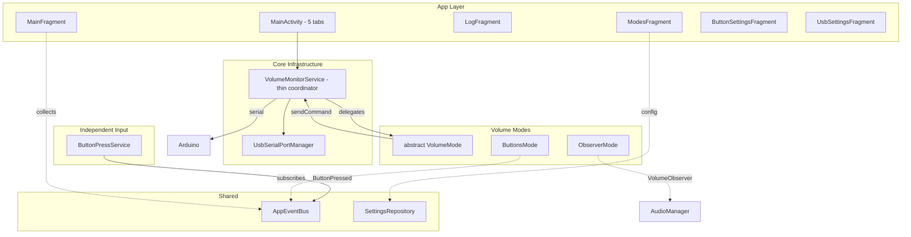
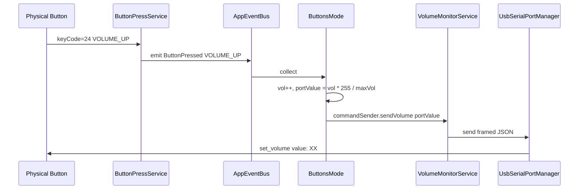

# План рефакторинга: Режимы управления громкостью

## 1. Текущее состояние (AS-IS)

### 1.1. Структура

```
VolumeMonitorService (core)          ← God-объект
├── VolumeObserver                   — отслеживание системной громкости
├── handleButtonPress()              — логика BUTTONS
├── syncButtonVolumeToPort()         — синхронизация BUTTONS при USB Connect
├── cachedControlMode                — кеш OBSERVER/BUTTONS
├── sendVolumeData()                 — отправка DeviceCommand.SetVolume через сериал
└── 3 подписки на AppEventBus

GeneralSettingsFragment (app/ui)     ← смешанные настройки
├── RadioGroup (OBSERVER / BUTTONS)
├── observerMaxSettingsLayout
└── buttonMaxVolumeSettingsLayout

MainFragment (app/ui)                ← дублирует логику режимов
├── updateVolumeDisplay() → if (BUTTONS) ... else (...)
├── localButtonVolume
└── localMaxButtonVolume
```

### 1.2. Проблемы

| # | Проблема |
|---|----------|
| 1 | God-сервис: VolumeMonitorService смешивает USB, уведомления, OBSERVER, BUTTONS |
| 2 | Размазанная логика: код режима в onCreate, collect-блоках, when-ветках |
| 3 | Сложное расширение: новый режим → правки в 4+ файлах |
| 4 | Дублирование в UI: MainFragment сам вычисляет громкость для каждого режима |
| 5 | Смешанные настройки: GeneralSettingsFragment = всё в одном RadioGroup |
| 6 | Кнопки привязаны к режиму: настройки BUTTONS в GeneralSettingsFragment |

---

## 2. Ключевые принципы

### Принцип 1: Режим выбирается один раз
Пользователь выбирает режим при настройке адаптера. Переключение туда-сюда — не основной сценарий. Не нужна сложная инфраструктура горячего переключения.

### Принцип 2: Только один активный режим
Одновременно работает ровно один режим.

### Принцип 3: Кнопки — отдельный независимый слой
ButtonPressService + ButtonSettingsFragment — самостоятельный компонент ввода. Не принадлежит ни одному режиму. Любой режим, которому нужны кнопки, подписывается на AppEvent.ButtonPressed.

---

## 3. Целевая архитектура (TO-BE)

### 3.1. Диаграмма компонентов



### 3.2. Слои приложения

```
UI Layer (app/)
├── MainFragment      — отображение громкости (только ModeStateChanged)
├── LogFragment       — история команд
├── ModesFragment     — выбор режима + настройки режима
├── ButtonSettingsFragment — независимые настройки ввода (keyCode, longPress)
└── UsbSettingsFragment    — выбор USB устройства

Core Layer (core/)
├── VolumeMonitorService   — USB + делегирование activeMode
│   ├── UsbSerialPortManager
│   └── VolumeMode (активный)
├── ButtonPressService     — независимый слой ввода (AccessibilityService)
├── AppEventBus            — шина событий
└── SettingsRepository     — хранение настроек
```

### 3.3. Контракт VolumeMode

```kotlin
data class ModeState(
    val currentVolume: Int,
    val maxVolume: Int,
    val displayLabel: String  // "system", "buttons", etc.
)

fun interface CommandSender {
    fun sendVolume(targetVolume: Int)  // 0..255
}

abstract class VolumeMode(
    protected val context: Context,
    protected val commandSender: CommandSender,
    protected val settingsRepository: SettingsRepository,
    protected val appEvents: SharedFlow<AppEvent>,
    val modeId: VolumeControlMode,
    val displayName: String,
    val description: String
) {
    protected val _state = MutableStateFlow(ModeState(0, 0, ""))
    val state: StateFlow<ModeState> = _state.asStateFlow()
    protected val modeScope = CoroutineScope(Dispatchers.Default + SupervisorJob())

    abstract fun start()
    open fun stop() { modeScope.cancel() }
    open fun onUsbConnected() {}
    open fun createSettingsView(parent: ViewGroup): View? = null
}
```

### 3.4. ObserverMode

```
ObserverMode : VolumeMode
├── VolumeObserver — владеет экземпляром
├── start(): register + collect volume -> commandSender.sendVolume(target)
├── stop(): unregister + modeScope.cancel()
├── onUsbConnected(): send current volume
├── Settings: MaxVolumeSource (SYSTEM/CUSTOM), customMaxVolume
└── SettingsView: CheckBox + EditText
```

### 3.5. ButtonsMode

```
ButtonsMode : VolumeMode
├── buttonCurrentVolume (0..maxVolume)
├── start(): collect AppEvent.ButtonPressed -> handleButtonPress()
├── handleButtonPress(): +/-1, convert to 0..255, send via commandSender
├── scheduleSave(): debounce 500ms -> SettingsRepository
├── onUsbConnected(): sync current volume
├── Settings: maxVolumeValue
└── SettingsView: EditText for maxVolumeValue
```

### 3.6. VolumeMonitorService после рефакторинга

```kotlin
class VolumeMonitorService : Service() {
    private lateinit var portManager: UsbSerialPortManager
    private lateinit var settingsRepository: SettingsRepository

    private val commandSender = CommandSender { target ->
        val cmd = DeviceCommand.SetVolume(target)
        val json = commandSerializer.serialize(cmd)
        portManager.send(commandSerializer.frame(json))
        AppEventBus.tryEmit(AppEvent.SerialDataSent(json))
    }

    private var activeMode: VolumeMode? = null

    override fun onCreate() {
        // init port, settings...
        activateMode(settingsRepository.getVolumeControlMode())
        // USB + mode change subscriptions...
    }

    private fun activateMode(modeId: VolumeControlMode) {
        activeMode?.stop()
        activeMode = when (modeId) {
            VolumeControlMode.OBSERVER -> ObserverMode(this, commandSender, settingsRepository)
            VolumeControlMode.BUTTONS -> ButtonsMode(this, commandSender, settingsRepository)
        }
        activeMode?.start()
    }
}
```

---

## 4. Кнопки — отдельный слой

### Текущая проблема
Настройки BUTTONS (maxVolume) в GeneralSettingsFragment, а не в ButtonSettingsFragment.

### Целевое решение
- ButtonPressService — слой ввода: перехват клавиш + ButtonPressed в шину
- ButtonSettingsFragment — UI ввода: keyCode, longPressDelay. Не знает о режимах.
- ButtonsMode — подписывается на ButtonPressed, использует кнопки.



---

## 5. Пошаговый план

### Шаг 1: Создать VolumeMode.kt
Новый файл: `core/.../volume/mode/VolumeMode.kt`
- ModeState, CommandSender, VolumeMode abstract class
- Не ломает существующий код

### Шаг 2: ObserverMode.kt
Новый файл. Перенести из VolumeMonitorService:
- VolumeObserver создание/управление
- volumeObserver.volume.collect -> commandSender
- ObserverSettingsChanged обработку

### Шаг 3: ButtonsMode.kt
Новый файл. Перенести из VolumeMonitorService:
- buttonCurrentVolume, handleButtonPress, buttonVolumeToPort
- syncButtonVolumeToPort, scheduleButtonVolumeSave

### Шаг 4: VolumeMonitorService
Удалить: volumeObserver, buttonCurrentVolume, cachedControlMode, buttonVolumeSaveJob, if-ветки
Добавить: activeMode, commandSender, activateMode()

### Шаг 5: GeneralSettingsFragment -> ModesFragment
Переименовать файлы, новый UI (карточки вместо RadioGroup)

### Шаг 6: MainActivity
tabTexts: "Общие" -> "Режимы", GeneralSettingsFragment -> ModesFragment

### Шаг 7: AppEventBus
Добавить ModeStateChanged, ModeSettingsChanged. Удалить ObserverSettingsChanged.

### Шаг 8: MainFragment
Упростить updateVolumeDisplay до одной строки через ModeStateChanged.

---

## 6. Сводка

### Новые файлы (3)
- `core/.../volume/mode/VolumeMode.kt`
- `core/.../volume/mode/ObserverMode.kt`
- `core/.../volume/mode/ButtonsMode.kt`

### Изменяемые (7)
- VolumeMonitorService.kt (~40% удаления)
- MainActivity.kt (таб + импорт)
- GeneralSettingsFragment.kt -> ModesFragment.kt
- fragment_general_settings.xml -> fragment_modes.xml
- MainFragment.kt (упрощение)
- AppEventBus.kt (события)
- SettingsRepository.kt / Impl (мелкие дополнения)

### Неизменные (7)
- VolumeObserver.kt, UsbSerialPortManager.kt, ButtonPressService.kt
- ButtonLearnManager.kt, ButtonSettingsFragment.kt
- UsbSettingsFragment.kt, LogFragment.kt

---

## 7. Критерии приёмки

- [x] План документирован
- [ ] Вкладка "Общие" -> "Режимы"
- [ ] Каждый режим — самостоятельный класс VolumeMode
- [ ] VolumeMonitorService без прямой логики режимов
- [ ] ButtonPressService + ButtonSettingsFragment — независимый слой
- [ ] ButtonsMode получает кнопки через AppEventBus
- [ ] MainFragment.updateVolumeDisplay() — одна строка
- [ ] Новый режим = новый файл + 1 строка в activateMode()
- [ ] OBSERVER и BUTTONS работают без регрессий
- [ ] Команды через сериал порт работают для всех режимов
