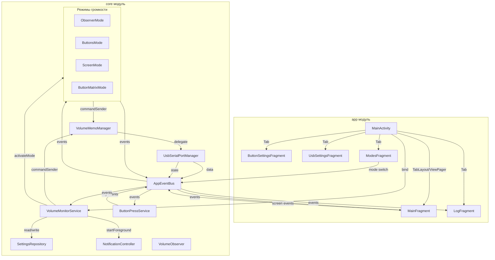

# Отчёт аудита проекта VolumeMonitor

Дата: 2026-06-19  
Проанализированы: все исходные файлы модулей `app` и `core`, конфигурации сборки, манифест

---

## 1. Архитектурные проблемы

### 1.1. `VolumeMonitorService.sendCommand()` обходит VolumeMemoManager — WARNING (85%)

**Файл:** [`core/src/main/java/com/example/volumemonitor/core/VolumeMonitorService.kt:143-148`](../core/src/main/java/com/example/volumemonitor/core/VolumeMonitorService.kt:143)

Существует два пути отправки команд:
- Через `commandSender` (VolumeMemoManager → rawCommandSender → portManager) — используется режимами, поддерживает debounce SetVolumeMemo
- Через `sendCommand()` напрямую в `portManager.send()` — используется из UI (бас, смена пресета)

Хотя `sendCommand()` не отправляет `SetVolume` (только `SetBassLevel`, `ChangePreset`, `GetPreset`), архитектурно это расщепление создаёт риск: если кто-то в будущем вызовет `sendCommand(DeviceCommand.SetVolume(...))`, debounce-сохранение в EEPROM будет обойдено. Все вызовы отправки команд должны проходить через единый `CommandSender`.

### 1.2. `NotificationController` использует FLAG_IMMUTABLE без проверки API — WARNING (90%)

**Файл:** [`core/src/main/java/com/example/volumemonitor/core/notification/NotificationController.kt:41`](../core/src/main/java/com/example/volumemonitor/core/notification/NotificationController.kt:41)

```kotlin
PendingIntent.getActivity(context, 0, launchIntent,
    PendingIntent.FLAG_UPDATE_CURRENT or PendingIntent.FLAG_IMMUTABLE)
```

`FLAG_IMMUTABLE` доступен только с API 31 (Android 12). При `minSdk 18` этот код крашнется на устройствах с API < 31, если будет вызван fallback-путь (когда `contentIntent` == null, что происходит при первом вызове `build()` без параметра в [`VolumeMonitorService.onCreate:241`](../core/src/main/java/com/example/volumemonitor/core/VolumeMonitorService.kt:241)). Необходимо добавить проверку `Build.VERSION.SDK_INT >= Build.VERSION_CODES.M` (API 23 — минимальный для `FLAG_IMMUTABLE` в контексте `PendingIntent`).

### 1.3. Первое уведомление строится без PendingIntent — WARNING (80%)

**Файл:** [`core/src/main/java/com/example/volumemonitor/core/VolumeMonitorService.kt:241`](../core/src/main/java/com/example/volumemonitor/core/VolumeMonitorService.kt:241)

```kotlin
startForeground(Constants.NOTIFICATION_ID, notificationController.build())
```

`build()` вызывается без PendingIntent. В этот момент `setNotificationPendingIntent()` ещё не вызван (он вызывается в `MainActivity.onServiceConnected`). Нотификация будет без кликабельного действия до момента вызова `setNotificationPendingIntent`. Проблема усугубляется тем, что `build()` кэширует параметры, и перестроение нотификации с Intent не происходит.

---

## 2. Функциональные проблемы

### 2.1. `MainFragment.refreshVolumeDisplay()` не синхронизирует позицию SeekBar для SCREEN-режима — WARNING (85%)

**Файл:** [`app/src/main/java/com/example/volumemonitor/ui/MainFragment.kt:374-377`](../app/src/main/java/com/example/volumemonitor/ui/MainFragment.kt:374)

Код читает `settingsRepository.getScreenCurrentVolume()` для текстовой метки, но НЕ обновляет `screenVolumeSeekBar.progress`. В обработчике `ModeStateChanged` SeekBar синхронизируется (строка 235-237). При вызове `refreshVolumeDisplay()` через `onResume` или `VolumeChanged` fallback возникает рассинхронизация: текст показывает актуальное значение, ползунок — старое.

### 2.2. Несогласованный формат текста громкости между refreshVolumeDisplay и ModeStateChanged — WARNING (90%)

**Файлы:**  
[`app/src/main/java/com/example/volumemonitor/ui/MainFragment.kt:355-380`](../app/src/main/java/com/example/volumemonitor/ui/MainFragment.kt:355)  
[`app/src/main/java/com/example/volumemonitor/ui/MainFragment.kt:229`](../app/src/main/java/com/example/volumemonitor/ui/MainFragment.kt:229)

`refreshVolumeDisplay()` формирует подробный текст:
- OBSERVER: `"Громкость: $current / $max (системная)"` 
- BUTTONS: `"Громкость: $current / $max (кнопки)"`
- BUTTON_MATRIX: `"Режим матрицы кнопок"`

`ModeStateChanged` handler формирует:
- Все режимы: `"Громкость: ${event.currentVolume} / ${event.maxVolume} (${event.displayLabel})"`
- Для BUTTON_MATRIX это даст: `"Громкость: 0 / 0 (матрица)"` — что отличается от `"Режим матрицы кнопок"` и показывает бессмысленные 0/0.

Текст громкости «прыгает» между двумя форматами при получении событий.

### 2.3. Дублирование логики управления видимостью UI-элементов — SUGGESTION (75%)

**Файлы:**  
[`app/src/main/java/com/example/volumemonitor/ui/MainFragment.kt:232-233`](../app/src/main/java/com/example/volumemonitor/ui/MainFragment.kt:232)  
[`app/src/main/java/com/example/volumemonitor/ui/MainFragment.kt:383-385`](../app/src/main/java/com/example/volumemonitor/ui/MainFragment.kt:383)

Однотипная логика `screenVolumeLayout.visibility` и `matrixButtonsLayout.visibility` дублируется в обработчике `ModeStateChanged` и в `refreshVolumeDisplay()`. При добавлении новых режимов с новыми layout'ами легко пропустить обновление в одном из мест.

### 2.4. `ButtonPressService` — состояние долгого нажатия не полностью изолировано — WARNING (80%)

**Файл:** [`core/src/main/java/com/example/volumemonitor/core/button/ButtonPressService.kt:199-253`](../core/src/main/java/com/example/volumemonitor/core/button/ButtonPressService.kt:199)

Сценарий:
1. Пользователь нажимает Vol+ (устанавливается `activeKeyCode = keyCode_A`, запускается таймер долгого нажатия)
2. Пользователь нажимает кнопку матрицы (keyCode_B), удерживая Vol+
3. Матрица обрабатывается в `handleMatrixKeyDown`, но `activeKeyCode` остаётся `keyCode_A`
4. При отпускании Vol+ вызывается `handleKeyUp(keyCode_A)` — он совпадает с `activeKeyCode`, сбрасывает состояние
5. Если пользователь отпускает кнопку матрицы первой — `handleMatrixKeyUp` вызывается, но не затрагивает состояние Vol+

Это не вызывает крашей, но логика состояния нажатия не полностью изолирована между разными типами кнопок. Рекомендуется использовать отдельные переменные состояния для Vol± и матрицы.

### 2.5. `sendBassCommand()` не обновляет `lastSentBassLevel` — MINOR (70%)

**Файл:** [`app/src/main/java/com/example/volumemonitor/ui/MainFragment.kt:105-109`](../app/src/main/java/com/example/volumemonitor/ui/MainFragment.kt:105)

Метод `sendBassCommand()` не устанавливает `lastSentBassLevel`. Он обновляется только в местах вызова (SeekBar listener, кнопки ±). Если кто-то вызовет `sendBassCommand()` напрямую, трекинг отправленного уровня не обновится. Сейчас это не проблема, так как метод вызывается только из трёх мест, где `lastSentBassLevel` устанавливается явно.

---

## 3. Потенциальные race conditions и проблемы жизненного цикла

### 3.1. SharedFlow без replay — возможна потеря событий — WARNING (85%)

**Файл:** [`core/src/main/java/com/example/volumemonitor/core/event/AppEventBus.kt:15`](../core/src/main/java/com/example/volumemonitor/core/event/AppEventBus.kt:15)

```kotlin
private val _events = MutableSharedFlow<AppEvent>(extraBufferCapacity = 16)
```

`SharedFlow` не имеет replay. Если сервис перезапускается (например, убит системой и перезапущен), события, отправленные в момент недоступности сервиса, теряются. При старте сервиса в `onCreate` коллекторы подписываются после инициализации режимов — события, эмитированные до подписки, также теряются. Для критичных событий (например, `VolumeControlModeChanged`) это означает, что смена режима из UI может не дойти до сервиса, если сервис был убит. Рекомендуется использовать `SharedFlow` с `replay = 1` для `VolumeControlModeChanged` и `ObserverSettingsChanged`, либо проверять сохранённое состояние при старте сервиса (что уже делается: `settingsRepository.getVolumeControlMode()` в строке 193).

### 3.2. `UsbSettingsFragment` регистрирует собственный BroadcastReceiver — SUGGESTION (65%)

**Файл:** [`app/src/main/java/com/example/volumemonitor/ui/UsbSettingsFragment.kt:68-87, 217-229`](../app/src/main/java/com/example/volumemonitor/ui/UsbSettingsFragment.kt:68)

Фрагмент регистрирует свой USB-ресивер в `onResume` и разрегистрирует в `onPause`. Параллельно `VolumeMonitorService` имеет свой ресивер для тех же событий. Это создаёт дублирующуюся обработку. Если фрагмент будет уничтожен без вызова `onPause` (редкий, но возможный сценарий), ресивер утечёт.

---

## 4. Проблемы безопасности и совместимости

### 4.1. `compileSdk 33`, `targetSdk 33` — устаревшая версия — SUGGESTION (60%)

**Файлы:** [`app/build.gradle:8`](../app/build.gradle:8), [`core/build.gradle:8`](../core/build.gradle:8)

Google Play требует `targetSdk 34` для новых приложений с августа 2024 года. Для обновлений существующих приложений это требование вступает в силу позже, но рекомендуется обновить до `compileSdk 34` / `targetSdk 34`.

### 4.2. `kotlin-stdlib` vs `kotlin-stdlib-jdk8` — расхождение между модулями — MINOR (55%)

**Файлы:** [`app/build.gradle:49`](../app/build.gradle:49), [`core/build.gradle:32`](../core/build.gradle:32)

Модуль `app` использует `kotlin-stdlib` (без jdk8) с комментарием «избегаем Java 8 API на Dalvik». Модуль `core` использует `kotlin-stdlib-jdk8`. Это может вызвать проблемы на старых устройствах (API < 24), если `core` использует Java 8 API, отсутствующие в Dalvik. Однако `coreLibraryDesugaring` включён в `app/build.gradle`, что должно решить эту проблему.

---

## 5. Сводная таблица проблем

| # | Severity | Файл:строка | Проблема | Уверенность |
|---|----------|-------------|----------|-------------|
| 1 | WARNING | `VolumeMonitorService.kt:143-148` | `sendCommand()` обходит VolumeMemoManager | 85% |
| 2 | WARNING | `NotificationController.kt:41` | FLAG_IMMUTABLE без проверки API | 90% |
| 3 | WARNING | `VolumeMonitorService.kt:241` | Первое уведомление без PendingIntent | 80% |
| 4 | WARNING | `MainFragment.kt:374-377` | SeekBar не синхронизируется в refreshVolumeDisplay | 85% |
| 5 | WARNING | `MainFragment.kt:229 vs 355-380` | Несогласованный формат текста громкости | 90% |
| 6 | WARNING | `ButtonPressService.kt:199-253` | Состояние долгого нажатия не изолировано | 80% |
| 7 | WARNING | `AppEventBus.kt:15` | SharedFlow без replay — потеря событий | 85% |
| 8 | SUGGESTION | `MainFragment.kt:232-233, 383-385` | Дублирование логики видимости | 75% |
| 9 | SUGGESTION | `UsbSettingsFragment.kt:68-87` | Дублирующийся USB-ресивер | 65% |
| 10 | MINOR | `MainFragment.kt:105-109` | lastSentBassLevel не обновляется в sendBassCommand | 70% |
| 11 | SUGGESTION | `app/build.gradle:8` | Устаревший targetSdk 33 | 60% |
| 12 | MINOR | `app/build.gradle:49` | Расхождение kotlin-stdlib между модулями | 55% |

---

## 6. Диаграмма архитектуры



---

## 7. Рекомендации

1. **Критически важно:** Исправить `FLAG_IMMUTABLE` в `NotificationController` — добавить проверку API (п. 1.2)
2. **Важно:** Синхронизировать SeekBar в `refreshVolumeDisplay()` для SCREEN-режима (п. 2.1)
3. **Важно:** Унифицировать формат текста громкости между `refreshVolumeDisplay()` и `ModeStateChanged` (п. 2.2)
4. **Желательно:** Выделить логику видимости в отдельный метод `syncModeVisibility()` (п. 2.3)
5. **Желательно:** Изолировать состояние долгого нажатия между Vol± и матрицей (п. 2.4)
6. **Желательно:** Пропускать все вызовы отправки команд через единый `CommandSender`, включая `sendCommand()` (п. 1.1)
