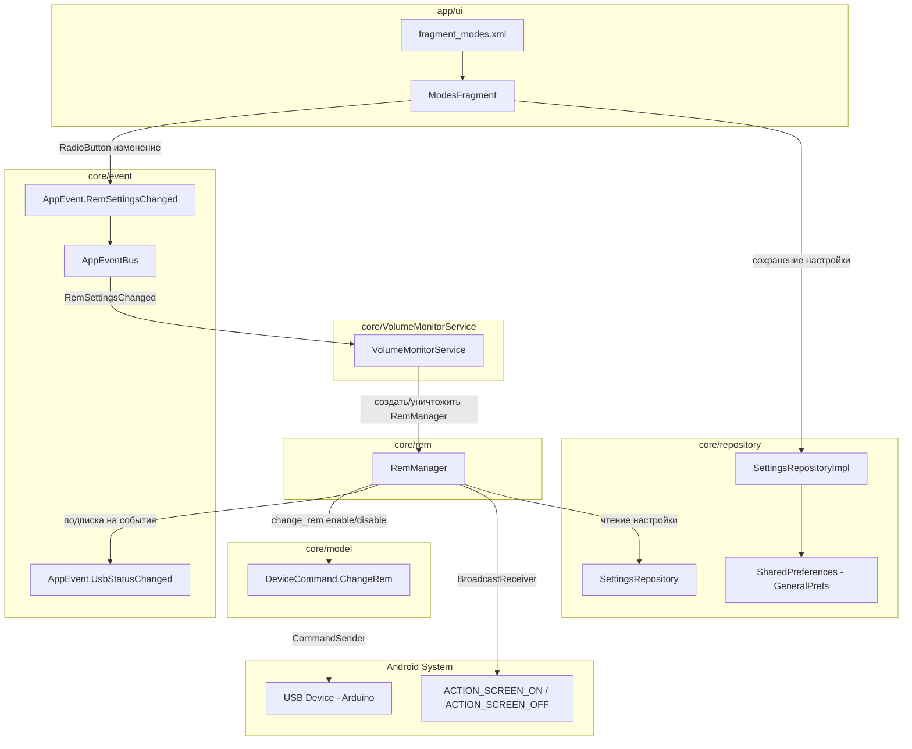
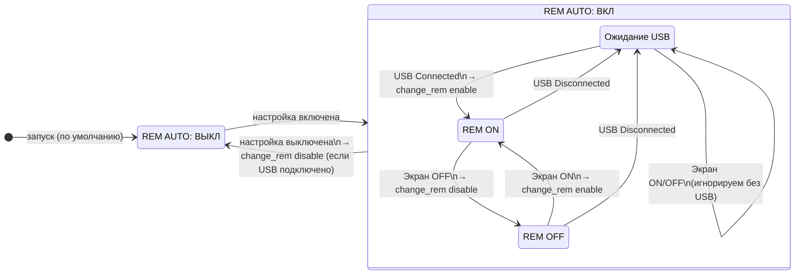

# План: Управление REM

## Обзор

Добавление функционала автоматического управления REM (функция аудиоустройства) в приложение VolumeMonitor. REM управляется командами `change_rem enable`/`change_rem disable`, отправляемыми на устройство через serial port.

## Архитектурное решение

REM — **не новый режим управления громкостью** (`VolumeControlMode`), а отдельная независимая функция. Поэтому:

- **НЕ добавляем** новый элемент в `enum VolumeControlMode`
- Добавляем **отдельную секцию** в UI `ModesFragment` после RadioGroup режимов громкости
- Создаем **отдельный класс `RemManager`** с инкапсулированной логикой

---

## Диаграмма архитектуры



## Диаграмма состояний RemManager



## Логика автоматического управления

| Событие | Действие |
|---------|----------|
| USB подключено (`UsbPortState.Connected`) — устройство загрузилось | Отправить `change_rem enable` |
| Экран выключен (`ACTION_SCREEN_OFF`) | Отправить `change_rem disable` |
| Экран включен (`ACTION_SCREEN_ON`) после выключения | Отправить `change_rem enable` |
| USB отключено (`UsbPortState.Disconnected`) | Сбросить состояние, перестать отправлять команды |
| Настройка REM выключена пользователем | Если USB подключено — отправить `change_rem disable`, остановить отслеживание |

---

## Пошаговый план реализации

### Шаг 1. DeviceCommand.kt — новая команда ChangeRem

**Файл:** [`core/src/main/java/com/example/volumemonitor/core/model/DeviceCommand.kt`](core/src/main/java/com/example/volumemonitor/core/model/DeviceCommand.kt)

Добавить внутрь `sealed class DeviceCommand`:

```kotlin
/** Включить/выключить REM на устройстве. */
data class ChangeRem(val enable: Boolean) : DeviceCommand() {
    override val commandName = "change_rem"
    override fun toJson(): String {
        val value = if (enable) "enable" else "disable"
        return """{"command":"$commandName","value":"$value"}"""
    }
}
```

### Шаг 2. Constants.kt — новые константы

**Файл:** [`core/src/main/java/com/example/volumemonitor/core/Constants.kt`](core/src/main/java/com/example/volumemonitor/core/Constants.kt)

Добавить в `object Constants`:

```kotlin
// ── REM ──
const val KEY_REM_AUTO_MODE = "rem_auto_mode"
const val DEFAULT_REM_AUTO_MODE = false
```

### Шаг 3. SettingsRepository.kt — новые методы в интерфейсе

**Файл:** [`core/src/main/java/com/example/volumemonitor/core/repository/SettingsRepository.kt`](core/src/main/java/com/example/volumemonitor/core/repository/SettingsRepository.kt)

Добавить методы:

```kotlin
// ── REM ──
fun getRemAutoMode(): Boolean
fun saveRemAutoMode(enabled: Boolean)
```

### Шаг 4. SettingsRepositoryImpl.kt — реализация

**Файл:** [`core/src/main/java/com/example/volumemonitor/core/repository/SettingsRepositoryImpl.kt`](core/src/main/java/com/example/volumemonitor/core/repository/SettingsRepositoryImpl.kt)

Добавить реализацию (используем `generalPrefs`):

```kotlin
override fun getRemAutoMode(): Boolean =
    generalPrefs.getBoolean(Constants.KEY_REM_AUTO_MODE, Constants.DEFAULT_REM_AUTO_MODE)

override fun saveRemAutoMode(enabled: Boolean) {
    generalPrefs.edit().putBoolean(Constants.KEY_REM_AUTO_MODE, enabled).apply()
}
```

### Шаг 5. AppEventBus.kt — новое событие

**Файл:** [`core/src/main/java/com/example/volumemonitor/core/event/AppEventBus.kt`](core/src/main/java/com/example/volumemonitor/core/event/AppEventBus.kt)

Добавить в `sealed class AppEvent`:

```kotlin
/** Настройка автоматического управления REM изменена. */
object RemSettingsChanged : AppEvent()
```

### Шаг 6. RemManager.kt — новый класс (ключевой)

**Файл (новый):** [`core/src/main/java/com/example/volumemonitor/core/rem/RemManager.kt`](core/src/main/java/com/example/volumemonitor/core/rem/RemManager.kt)

```kotlin
package com.example.volumemonitor.core.rem

import android.content.BroadcastReceiver
import android.content.Context
import android.content.Intent
import android.content.IntentFilter
import android.util.Log
import com.example.volumemonitor.core.event.AppEvent
import com.example.volumemonitor.core.model.DeviceCommand
import com.example.volumemonitor.core.usb.UsbPortState
import com.example.volumemonitor.core.volume.mode.CommandSender
import kotlinx.coroutines.CoroutineScope
import kotlinx.coroutines.Dispatchers
import kotlinx.coroutines.SupervisorJob
import kotlinx.coroutines.cancel
import kotlinx.coroutines.flow.SharedFlow
import kotlinx.coroutines.launch

/**
 * Инкапсулированная логика автоматического управления REM.
 *
 * Отслеживает:
 * - Подключение/отключение USB (через AppEventBus)
 * - Включение/выключение экрана (через BroadcastReceiver)
 *
 * Отправляет команды change_rem enable/disable на устройство
 * в соответствии с правилами автоматического управления.
 */
class RemManager(
    private val context: Context,
    private val commandSender: CommandSender,
    private val appEvents: SharedFlow<AppEvent>
) {
    private val TAG = "RemManager"
    private val scope = CoroutineScope(Dispatchers.Default + SupervisorJob())

    private var isUsbConnected = false
    private var isScreenOn = true          // начальное состояние — экран включен
    private var lastRemState: Boolean? = null  // последнее отправленное состояние REM

    private val screenReceiver = object : BroadcastReceiver() {
        override fun onReceive(context: Context, intent: Intent) {
            when (intent.action) {
                Intent.ACTION_SCREEN_OFF -> {
                    Log.d(TAG, "Экран выключен → disable REM")
                    isScreenOn = false
                    sendRemCommand(false)
                }
                Intent.ACTION_SCREEN_ON -> {
                    Log.d(TAG, "Экран включен → enable REM")
                    isScreenOn = true
                    sendRemCommand(true)
                }
            }
        }
    }

    fun start() {
        Log.d(TAG, "Запуск RemManager")

        // Регистрируем приёмник экрана
        val filter = IntentFilter().apply {
            addAction(Intent.ACTION_SCREEN_ON)
            addAction(Intent.ACTION_SCREEN_OFF)
        }
        context.registerReceiver(screenReceiver, filter)

        // Инициализируем текущее состояние экрана
        // (экран считается включенным при старте, если приложение запущено)

        // Подписка на события USB
        scope.launch {
            appEvents.collect { event ->
                when (event) {
                    is AppEvent.UsbStatusChanged -> {
                        when (event.status) {
                            is UsbPortState.Connected -> {
                                Log.d(TAG, "USB подключено → enable REM")
                                isUsbConnected = true
                                sendRemCommand(true)
                            }
                            is UsbPortState.Disconnected,
                            is UsbPortState.Error -> {
                                Log.d(TAG, "USB отключено/ошибка")
                                isUsbConnected = false
                            }
                            else -> { /* Initializing — ничего не делаем */ }
                        }
                    }
                    else -> {}
                }
            }
        }
    }

    fun stop() {
        Log.d(TAG, "Остановка RemManager")

        // Отключаем REM при остановке, если USB подключено
        if (isUsbConnected) {
            sendRemCommand(false)
        }

        // Снимаем приёмник экрана
        try {
            context.unregisterReceiver(screenReceiver)
        } catch (_: Exception) {}

        scope.cancel()
    }

    private fun sendRemCommand(enable: Boolean) {
        if (!isUsbConnected) {
            Log.d(TAG, "sendRemCommand($enable): USB не подключено, пропускаем")
            return
        }
        if (lastRemState == enable) {
            Log.d(TAG, "sendRemCommand($enable): состояние не изменилось, пропускаем")
            return
        }
        lastRemState = enable
        Log.d(TAG, "→ Отправка change_rem ${if (enable) "enable" else "disable"}")
        commandSender.send(DeviceCommand.ChangeRem(enable))
    }
}
```

### Шаг 7. VolumeMonitorService.kt — интеграция RemManager

**Файл:** [`core/src/main/java/com/example/volumemonitor/core/VolumeMonitorService.kt`](core/src/main/java/com/example/volumemonitor/core/VolumeMonitorService.kt)

Добавить:

```kotlin
import com.example.volumemonitor.core.rem.RemManager

// В теле класса:
private var remManager: RemManager? = null

// В onCreate, в блоке подписки на события:
serviceScope.launch {
    AppEventBus.events.collect { event ->
        when (event) {
            is AppEvent.VolumeControlModeChanged -> { ... }
            is AppEvent.RemSettingsChanged -> {
                updateRemManager()
            }
            else -> {}
        }
    }
}

// После activateMode(savedModeId) в onCreate:
updateRemManager()

// Новый приватный метод:
private fun updateRemManager() {
    val enabled = settingsRepository.getRemAutoMode()
    Log.d(TAG, "updateRemManager: autoMode=$enabled")
    if (enabled) {
        if (remManager == null) {
            remManager = RemManager(
                context = this,
                commandSender = rawCommandSender,  // без debounce
                appEvents = AppEventBus.events
            ).also { it.start() }
        }
    } else {
        remManager?.stop()
        remManager = null
    }
}

// В onDestroy, перед serviceScope.cancel():
remManager?.stop()
remManager = null
```

### Шаг 8. fragment_modes.xml — новый UI-раздел

**Файл:** [`app/src/main/res/layout/fragment_modes.xml`](app/src/main/res/layout/fragment_modes.xml)

Добавить после закрывающего тега `</RadioGroup>` (строка 153) и перед `<TextView android:id="@+id/modeDescriptionTextView">` новую секцию:

```xml
    <!-- ── Раздел управления REM ── -->

    <TextView
        android:layout_width="match_parent"
        android:layout_height="wrap_content"
        android:layout_marginTop="8dp"
        android:layout_marginBottom="8dp"
        android:text="Режим управления REM"
        android:textColor="#000000"
        android:textSize="18sp"
        android:textStyle="bold" />

    <TextView
        android:layout_width="wrap_content"
        android:layout_height="wrap_content"
        android:layout_marginBottom="12dp"
        android:text="Автоматическое включение/выключение REM на устройстве при изменении состояния экрана."
        android:textColor="#666666"
        android:textSize="14sp" />

    <RadioButton
        android:id="@+id/radioRemAuto"
        android:layout_width="match_parent"
        android:layout_height="wrap_content"
        android:layout_marginBottom="16dp"
        android:padding="8dp"
        android:text="Автоматическое управление REM"
        android:textColor="#000000"
        android:textSize="16sp" />
```

### Шаг 9. ModesFragment.kt — логика REM-раздела

**Файл:** [`app/src/main/java/com/example/volumemonitor/ui/ModesFragment.kt`](app/src/main/java/com/example/volumemonitor/ui/ModesFragment.kt)

Добавить:

```kotlin
// Новое поле:
private lateinit var remAutoRadioButton: RadioButton

// В onViewCreated, после findViewById для существующих view:
remAutoRadioButton = view.findViewById(R.id.radioRemAuto)

// Восстанавливаем настройку REM:
val remAutoMode = settingsRepository.getRemAutoMode()
remAutoRadioButton.isChecked = remAutoMode

// Обработчик изменения:
remAutoRadioButton.setOnCheckedChangeListener { _, isChecked ->
    settingsRepository.saveRemAutoMode(isChecked)
    AppEventBus.tryEmit(AppEvent.RemSettingsChanged)
    Log.d(TAG, "REM авто-режим: $isChecked")
}
```

### Шаг 10. Обновление описания

Убедиться, что `updateModeDescription()` корректно отражает существующие режимы. Для REM отдельное описание не требуется, так как пояснение встроено в макет.

---

## Сводка изменяемых файлов

| # | Файл | Тип изменения |
|---|------|---------------|
| 1 | [`DeviceCommand.kt`](core/src/main/java/com/example/volumemonitor/core/model/DeviceCommand.kt) | Добавить `data class ChangeRem` |
| 2 | [`Constants.kt`](core/src/main/java/com/example/volumemonitor/core/Constants.kt) | Добавить `KEY_REM_AUTO_MODE`, `DEFAULT_REM_AUTO_MODE` |
| 3 | [`SettingsRepository.kt`](core/src/main/java/com/example/volumemonitor/core/repository/SettingsRepository.kt) | Добавить `getRemAutoMode()`, `saveRemAutoMode()` |
| 4 | [`SettingsRepositoryImpl.kt`](core/src/main/java/com/example/volumemonitor/core/repository/SettingsRepositoryImpl.kt) | Реализовать новые методы |
| 5 | [`AppEventBus.kt`](core/src/main/java/com/example/volumemonitor/core/event/AppEventBus.kt) | Добавить `RemSettingsChanged` |
| 6 | **Новый:** [`RemManager.kt`](core/src/main/java/com/example/volumemonitor/core/rem/RemManager.kt) | Создать класс с инкапсулированной логикой |
| 7 | [`VolumeMonitorService.kt`](core/src/main/java/com/example/volumemonitor/core/VolumeMonitorService.kt) | Интегрировать RemManager |
| 8 | [`fragment_modes.xml`](app/src/main/res/layout/fragment_modes.xml) | Добавить секцию REM |
| 9 | [`ModesFragment.kt`](app/src/main/java/com/example/volumemonitor/ui/ModesFragment.kt) | Добавить логику RadioButton REM |
