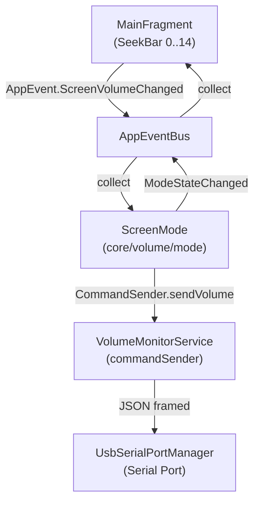

# План: Добавление режима «Управление с экрана» (ScreenMode)

## Обзор

Новый режим `SCREEN` — пользователь двигает ползунок на 15 положений (0–14) на главном экране, громкость отправляется на Arduino через serial port. Ползунок расположен над регулятором баса в [`fragment_main.xml`](app/src/main/res/layout/fragment_main.xml:27) и виден **только** когда активен режим SCREEN.

## Архитектурная схема



Новый режим вписывается в существующую архитектуру:
- `ScreenMode` наследуется от [`VolumeMode`](core/src/main/java/com/example/volumemonitor/core/volume/mode/VolumeMode.kt:38)
- Получает события `ScreenVolumeChanged` из `AppEventBus` (аналогично тому, как [`ButtonsMode`](core/src/main/java/com/example/volumemonitor/core/volume/mode/ButtonsMode.kt:55-61) слушает `ButtonPressed`)
- `MainFragment` показывает/скрывает `SeekBar` в зависимости от `VolumeControlMode`, который приходит в `ModeStateChanged`

## Список изменений

### 1. `VolumeControlMode.kt` — добавить SCREEN в enum

**Файл:** [`core/src/main/java/com/example/volumemonitor/core/model/VolumeControlMode.kt`](core/src/main/java/com/example/volumemonitor/core/model/VolumeControlMode.kt:3)

Добавить значение `SCREEN` в enum `VolumeControlMode`.

### 2. `AppEventBus.kt` — добавить событие ScreenVolumeChanged

**Файл:** [`core/src/main/java/com/example/volumemonitor/core/event/AppEventBus.kt`](core/src/main/java/com/example/volumemonitor/core/event/AppEventBus.kt:24)

Добавить sealed class:
```kotlin
/** Ползунок громкости на экране сдвинут пользователем. value: 0..maxVolume (по умолчанию 0..14) */
data class ScreenVolumeChanged(val value: Int) : AppEvent()
```

### 3. `Constants.kt` — добавить константы

**Файл:** [`core/src/main/java/com/example/volumemonitor/core/Constants.kt`](core/src/main/java/com/example/volumemonitor/core/Constants.kt:3)

```kotlin
const val SCREEN_MAX_POSITION = 14           // 15 положений (0..14)
const val KEY_SCREEN_CURRENT_VOLUME = "screen_current_volume"
```

### 4. `SettingsRepository.kt` + `SettingsRepositoryImpl.kt` — сохранение громкости экрана

**Файлы:**
- [`core/src/main/java/com/example/volumemonitor/core/repository/SettingsRepository.kt`](core/src/main/java/com/example/volumemonitor/core/repository/SettingsRepository.kt:7)
- [`core/src/main/java/com/example/volumemonitor/core/repository/SettingsRepositoryImpl.kt`](core/src/main/java/com/example/volumemonitor/core/repository/SettingsRepositoryImpl.kt:9)

Добавить методы:
```kotlin
fun getScreenCurrentVolume(): Int       // default = 0
fun saveScreenCurrentVolume(volume: Int)
```

Хранить в `generalPrefs` (или `buttonPrefs`), ключ `KEY_SCREEN_CURRENT_VOLUME`.

### 5. `ScreenMode.kt` — новый файл режима

**Файл:** [`core/src/main/java/com/example/volumemonitor/core/volume/mode/ScreenMode.kt`](core/src/main/java/com/example/volumemonitor/core/volume/mode/) (новый)

```kotlin
class ScreenMode(...) : VolumeMode(
    modeId = VolumeControlMode.SCREEN,
    displayName = "Управление с экрана",
    description = "Громкость регулируется ползунком на главном экране. Значение сразу отправляется на Arduino."
)
```

Логика (по аналогии с [`ButtonsMode`](core/src/main/java/com/example/volumemonitor/core/volume/mode/ButtonsMode.kt:22)):
- `start()`: восстанавливает сохранённую громкость из `settingsRepository.getScreenCurrentVolume()`, эмитит `ModeStateChanged`
- Слушает `AppEvent.ScreenVolumeChanged`:
  - Конвертирует позицию ползунка (0..14) → значение порта (0..255) через `VolumeMath.buttonToPort(value, 14, 255)`
  - Отправляет через `commandSender.sendVolume(portValue)`
  - Сохраняет значение с дебаунсом 500 мс (как `scheduleButtonVolumeSave`)
  - Эмитит `ModeStateChanged`
- `onUsbConnected()`: синхронизирует текущую громкость на устройство
- Не имеет `createSettingsView()` (или минимальный — просто подсказка)

### 6. `VolumeMonitorService.kt` — добавить ScreenMode в activateMode()

**Файл:** [`core/src/main/java/com/example/volumemonitor/core/VolumeMonitorService.kt`](core/src/main/java/com/example/volumemonitor/core/VolumeMonitorService.kt:141)

В `activateMode()` добавить ветку:
```kotlin
VolumeControlMode.SCREEN -> ScreenMode(
    context = this,
    commandSender = commandSender,
    settingsRepository = settingsRepository,
    appEvents = AppEventBus.events
)
```

Импорт: `import com.example.volumemonitor.core.volume.mode.ScreenMode`

### 7. `fragment_main.xml` — добавить SeekBar громкости над басом

**Файл:** [`app/src/main/res/layout/fragment_main.xml`](app/src/main/res/layout/fragment_main.xml:2)

Добавить **перед** `LinearLayout` с басом (строка 27) новый блок:

```xml
<LinearLayout
    android:id="@+id/screenVolumeLayout"
    android:layout_width="match_parent"
    android:layout_height="44dp"
    android:layout_marginBottom="20dp"
    android:gravity="center_vertical"
    android:orientation="horizontal"
    android:visibility="gone">

    <TextView
        android:layout_width="54dp"
        android:layout_height="wrap_content"
        android:layout_marginEnd="10dp"
        android:text="Гром:"
        android:textColor="#000000"
        android:textSize="16sp" />

    <TextView
        android:id="@+id/screenVolumeValueTextView"
        android:layout_width="wrap_content"
        android:layout_height="wrap_content"
        android:layout_marginEnd="10dp"
        android:text="0"
        android:textColor="#000000"
        android:textSize="22sp" />

    <SeekBar
        android:id="@+id/screenVolumeSeekBar"
        android:layout_width="0dp"
        android:layout_height="wrap_content"
        android:layout_weight="1"
        android:max="14"
        android:progress="0" />
</LinearLayout>
```

### 8. `MainFragment.kt` — логика показа/скрытия и управления ползунком

**Файл:** [`app/src/main/java/com/example/volumemonitor/ui/MainFragment.kt`](app/src/main/java/com/example/volumemonitor/ui/MainFragment.kt:37)

Изменения:

1. **Новые поля:**
```kotlin
private lateinit var screenVolumeLayout: View
private lateinit var screenVolumeSeekBar: SeekBar
private lateinit var screenVolumeValueTextView: TextView
private var lastSentScreenVolume: Int? = null
```

2. **`onViewCreated`**: `findViewById` для новых View, настройка `setOnSeekBarChangeListener` (аналогично басу):
   - `onProgressChanged`: если `fromUser`, обновить текст, эмитить `AppEvent.ScreenVolumeChanged(progress)`
   - `onStopTrackingTouch`: сохранить значение через `settingsRepository.saveScreenCurrentVolume(progress)` (или положиться на дебаунс в ScreenMode)

3. **Подписка на `ModeStateChanged`**: показывать/скрывать `screenVolumeLayout`:
```kotlin
is AppEvent.ModeStateChanged -> {
    // существующая логика...
    val isScreenMode = event.modeId == VolumeControlMode.SCREEN
    screenVolumeLayout.visibility = if (isScreenMode) View.VISIBLE else View.GONE
    if (isScreenMode) {
        // синхронизировать положение ползунка с event.currentVolume
        if (screenVolumeSeekBar.progress != event.currentVolume) {
            screenVolumeSeekBar.progress = event.currentVolume
            screenVolumeValueTextView.text = "${event.currentVolume}"
        }
    }
}
```

4. **`refreshVolumeDisplay()`**: добавить ветку для `VolumeControlMode.SCREEN`:
```kotlin
VolumeControlMode.SCREEN -> {
    val current = settingsRepository.getScreenCurrentVolume()
    val max = Constants.SCREEN_MAX_POSITION
    "Громкость: $current / $max (экран)"
}
```

### 9. `ModesFragment.kt` — добавить RadioButton для SCREEN

**Файл:** [`app/src/main/java/com/example/volumemonitor/ui/ModesFragment.kt`](app/src/main/java/com/example/volumemonitor/ui/ModesFragment.kt:33)

1. В `onViewCreated` добавить обработку:
```kotlin
VolumeControlMode.SCREEN -> modeRadioGroup.check(R.id.radioScreen)
```

2. В `setOnCheckedChangeListener`:
```kotlin
R.id.radioScreen -> VolumeControlMode.SCREEN
```

3. Скрывать настройки OBSERVER/BUTTONS при выборе SCREEN (уже работает, т.к. условие `!= OBSERVER` скроет OBSERVER-настройки, `!= BUTTONS` скроет BUTTONS-настройки).

4. В `updateModeDescription`:
```kotlin
VolumeControlMode.SCREEN -> "Экран: громкость регулируется ползунком на главном экране."
```

### 10. `fragment_modes.xml` — добавить RadioButton для SCREEN

**Файл:** [`app/src/main/res/layout/fragment_modes.xml`](app/src/main/res/layout/fragment_modes.xml:2)

Добавить после `radioButtons` (строка 97):
```xml
<RadioButton
    android:id="@+id/radioScreen"
    android:layout_width="match_parent"
    android:layout_height="wrap_content"
    android:padding="8dp"
    android:text="Управление с экрана"
    android:textColor="#000000"
    android:textSize="16sp" />
```

## Порядок выполнения

1. `VolumeControlMode.kt` — добавить `SCREEN`
2. `AppEventBus.kt` — добавить `ScreenVolumeChanged`
3. `Constants.kt` — добавить `SCREEN_MAX_POSITION`, `KEY_SCREEN_CURRENT_VOLUME`
4. `SettingsRepository.kt` + `SettingsRepositoryImpl.kt` — методы get/save screen volume
5. `ScreenMode.kt` — новый файл режима
6. `VolumeMonitorService.kt` — добавить ScreenMode в activateMode()
7. `fragment_main.xml` — добавить screenVolumeLayout
8. `MainFragment.kt` — логика SeekBar и видимости
9. `fragment_modes.xml` — RadioButton SCREEN
10. `ModesFragment.kt` — обработка SCREEN в RadioGroup

## Зависимости между файлами

```
VolumeControlMode.kt  ──┬──> AppEventBus.kt (может параллельно)
                        ├──> Constants.kt
                        ├──> SettingsRepository.kt/.kt
                        ├──> ScreenMode.kt
                        └──> VolumeMonitorService.kt
fragment_main.xml ──> MainFragment.kt
fragment_modes.xml ──> ModesFragment.kt
```
