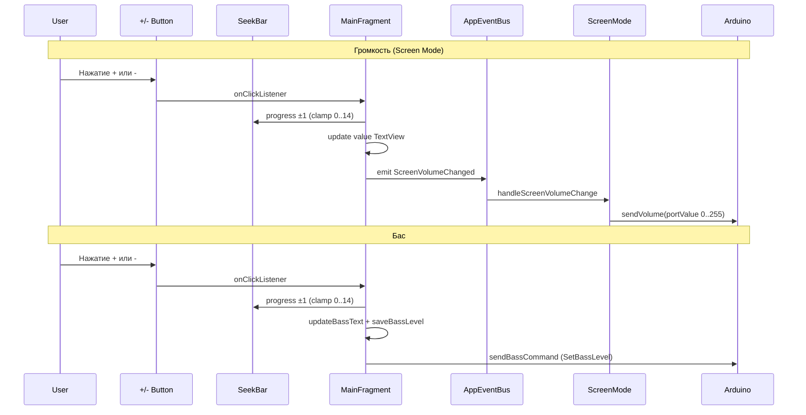

# План: Кнопки +/- для ползунков и унификация делений баса

## Задача

1. Добавить кнопки "+" и "-" по краям ползунков регулировки громкости и баса для удобного управления с экрана
2. Сделать для баса такой же ползунок на 14 делений (как у громкости)

---

## Анализ текущего состояния

### Ползунок громкости (Screen Mode)
- Файл: [`fragment_main.xml`](app/src/main/res/layout/fragment_main.xml:27-60)
- `screenVolumeSeekBar`: `android:max="14"` → 15 положений (0..14)
- Видим только когда активен режим SCREEN (`screenVolumeLayout.visibility`)
- Изменения обрабатываются в [`MainFragment.kt`](app/src/main/java/com/example/volumemonitor/ui/MainFragment.kt:130-138) — слушатель эмитит `AppEvent.ScreenVolumeChanged`
- Константа: [`Constants.SCREEN_MAX_POSITION = 14`](core/src/main/java/com/example/volumemonitor/core/Constants.kt:37)

### Ползунок баса
- Файл: [`fragment_main.xml`](app/src/main/res/layout/fragment_main.xml:62-94)
- `bassSeekBar`: `android:max="8"` → 9 положений (0..8)
- Всегда видим
- Изменения обрабатываются в [`MainFragment.kt`](app/src/main/java/com/example/volumemonitor/ui/MainFragment.kt:113-128) — слушатель отправляет команду `SetBassLevel` на Arduino
- Константы: [`Constants.BASS_MAX_POSITION = 8`](core/src/main/java/com/example/volumemonitor/core/Constants.kt:33), [`BASS_DEFAULT_POSITION = 4`](core/src/main/java/com/example/volumemonitor/core/Constants.kt:34)
- Математика в [`MainFragment.kt`](app/src/main/java/com/example/volumemonitor/ui/MainFragment.kt:69-75):
  - `bassPositionToPercent`: `(position * 100f / 8f)` — жёстко зашито 8
  - `bassPositionToValue`: конвертирует проценты в 0..255

---

## План изменений

### Шаг 1: Изменить `Constants.kt`

**Файл:** [`core/src/main/java/com/example/volumemonitor/core/Constants.kt`](core/src/main/java/com/example/volumemonitor/core/Constants.kt)

```kotlin
// Было:
const val BASS_MAX_POSITION = 8
const val BASS_DEFAULT_POSITION = 4

// Стало:
const val BASS_MAX_POSITION = 14          // 15 положений (0..14), как у громкости
const val BASS_DEFAULT_POSITION = 7       // середина 0..14
```

### Шаг 2: Изменить `fragment_main.xml`

**Файл:** [`app/src/main/res/layout/fragment_main.xml`](app/src/main/res/layout/fragment_main.xml)

#### 2a. Изменить `bassSeekBar.max`

```xml
<!-- Было: -->
android:max="8"

<!-- Стало: -->
android:max="14"
```

#### 2b. Добавить кнопки +/- для ползунка громкости

Текущая структура строки громкости (строки 27-60):
```xml
<LinearLayout>  <!-- screenVolumeLayout -->
    <TextView label="Громкость:" />
    <TextView id="screenVolumeValueTextView" />
    <SeekBar id="screenVolumeSeekBar" />
</LinearLayout>
```

Новая структура:
```xml
<LinearLayout>  <!-- screenVolumeLayout -->
    <TextView label="Громкость:" />
    <TextView id="screenVolumeValueTextView" />
    <Button id="screenVolumeMinusButton" text="-" width="48dp" />
    <SeekBar id="screenVolumeSeekBar" />
    <Button id="screenVolumePlusButton" text="+" width="48dp" />
</LinearLayout>
```

#### 2c. Добавить кнопки +/- для ползунка баса

Текущая структура строки баса (строки 62-94):
```xml
<LinearLayout>
    <TextView label="Bass:" />
    <TextView id="bassValueTextView" />
    <SeekBar id="bassSeekBar" />
</LinearLayout>
```

Новая структура:
```xml
<LinearLayout>
    <TextView label="Bass:" />
    <TextView id="bassValueTextView" />
    <Button id="bassMinusButton" text="-" width="48dp" />
    <SeekBar id="bassSeekBar" />
    <Button id="bassPlusButton" text="+" width="48dp" />
</LinearLayout>
```

### Шаг 3: Изменить `MainFragment.kt`

**Файл:** [`app/src/main/java/com/example/volumemonitor/ui/MainFragment.kt`](app/src/main/java/com/example/volumemonitor/ui/MainFragment.kt)

#### 3a. Обновить `bassPositionToPercent` — использовать 14 вместо 8

```kotlin
// Было:
private fun bassPositionToPercent(position: Int): Int =
    (position * 100f / 8f).roundToInt()

// Стало:
private fun bassPositionToPercent(position: Int): Int =
    (position * 100f / Constants.BASS_MAX_POSITION.toFloat()).roundToInt()
```

Примечание: нужно добавить импорт `com.example.volumemonitor.core.Constants` (уже есть, строка 22).

#### 3b. Добавить поля для кнопок

```kotlin
private lateinit var screenVolumeMinusButton: Button
private lateinit var screenVolumePlusButton: Button
private lateinit var bassMinusButton: Button
private lateinit var bassPlusButton: Button
```

#### 3c. Инициализировать кнопки в `onViewCreated`

```kotlin
screenVolumeMinusButton = view.findViewById(R.id.screenVolumeMinusButton)
screenVolumePlusButton = view.findViewById(R.id.screenVolumePlusButton)
bassMinusButton = view.findViewById(R.id.bassMinusButton)
bassPlusButton = view.findViewById(R.id.bassPlusButton)
```

#### 3d. Добавить обработчики нажатий

**Для громкости (screen volume):**
```kotlin
screenVolumeMinusButton.setOnClickListener {
    val newVal = (screenVolumeSeekBar.progress - 1).coerceAtLeast(0)
    screenVolumeSeekBar.progress = newVal
    screenVolumeValueTextView.text = "$newVal"
    AppEventBus.tryEmit(AppEvent.ScreenVolumeChanged(newVal))
}

screenVolumePlusButton.setOnClickListener {
    val newVal = (screenVolumeSeekBar.progress + 1).coerceAtMost(Constants.SCREEN_MAX_POSITION)
    screenVolumeSeekBar.progress = newVal
    screenVolumeValueTextView.text = "$newVal"
    AppEventBus.tryEmit(AppEvent.ScreenVolumeChanged(newVal))
}
```

**Для баса:**
```kotlin
bassMinusButton.setOnClickListener {
    val newVal = (bassSeekBar.progress - 1).coerceAtLeast(0)
    bassSeekBar.progress = newVal
    updateBassText(newVal)
    sendBassCommand(newVal)
    lastSentBassLevel = newVal
    saveBassLevel(newVal)
}

bassPlusButton.setOnClickListener {
    val newVal = (bassSeekBar.progress + 1).coerceAtMost(Constants.BASS_MAX_POSITION)
    bassSeekBar.progress = newVal
    updateBassText(newVal)
    sendBassCommand(newVal)
    lastSentBassLevel = newVal
    saveBassLevel(newVal)
}
```

### Шаг 4: Скомпилировать и проверить

Выполнить:
```bash
gradlew.bat :core:compileDebugKotlin :app:compileDebugKotlin
```

---

## Диаграмма взаимодействия



---

## Файлы, участвующие в изменениях

| Файл | Тип изменений |
|------|---------------|
| [`core/.../Constants.kt`](core/src/main/java/com/example/volumemonitor/core/Constants.kt) | Изменить `BASS_MAX_POSITION`, `BASS_DEFAULT_POSITION` |
| [`app/.../fragment_main.xml`](app/src/main/res/layout/fragment_main.xml) | Изменить `bassSeekBar.max`, добавить 4 кнопки |
| [`app/.../MainFragment.kt`](app/src/main/java/com/example/volumemonitor/ui/MainFragment.kt) | Обновить `bassPositionToPercent`, добавить поля и обработчики кнопок |
