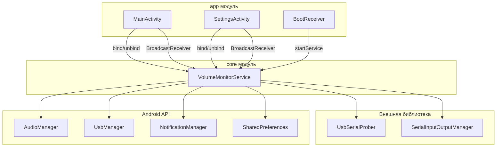
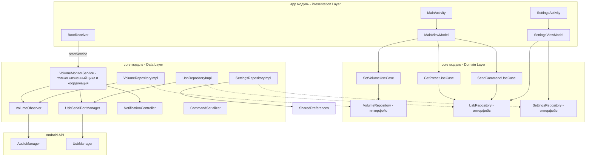

# План SOLID-рефакторинга VolumeMonitor

> **Контекст:** Android-приложение для мониторинга громкости и отправки данных на Arduino через USB Serial.
> **Ограничение:** версии SDK не повышаются (`compileSdk 33`, `targetSdk 33`, `minSdk 18`).

---

## 1. Анализ текущей архитектуры

### 1.1 Диаграмма текущей архитектуры



### 1.2 Ключевые проблемы (SOLID-анализ)

#### S — Single Responsibility Principle (Нарушен критически)

**[`VolumeMonitorService`](core/src/main/java/com/example/volumemonitor/core/VolumeMonitorService.kt)** (433 строки) — классический God Object:

| Обязанность | Строки |
|---|---|
| Управление жизненным циклом сервиса | 212-243, 300-312 |
| USB-соединение (открытие/закрытие) | 334-397 |
| Разрешения USB | 314-332 |
| Чтение данных от Arduino (буферизация + парсинг) | 51-83 |
| Отправка команд (JSON + framing) | 399-432 |
| Мониторинг громкости (AudioManager) | 154-176 |
| Уведомления (Notification + каналы) | 268-298 |
| SharedPreferences (сохранённое устройство) | 183-188 |
| Broadcast-коммуникация | 428-432 |
| USB-permission receiver | 96-151 |
| Volume receiver | 154-176 |

**[`MainActivity`](app/src/main/java/com/example/volumemonitor/MainActivity.kt)** (355 строк):

| Обязанность | Строки |
|---|---|
| UI (все View) | 262-273 |
| Управление Bass (SeekBar + сохранение) | 56-79, 196-214 |
| Управление пресетами | 280-309 |
| Отображение громкости | 336-349 |
| Bind/unbind сервиса | 151-179, 325-334 |
| 3 BroadcastReceiver'а в классе | 82-149 |
| SharedPreferences для bass | 56-65 |
| Регистрация receiver'ов | 312-323 |
| Форматирование и парсинг данных | 48, 100-148 |

**[`SettingsActivity`](app/src/main/java/com/example/volumemonitor/SettingsActivity.kt)** (332 строки):

| Обязанность | Строки |
|---|---|
| UI (список устройств, кнопки) | 142-176 |
| Сканирование USB-устройств | 276-300 |
| Сохранение выбранного устройства | 179-211 |
| Запрос USB-разрешений | 302-331 |
| Bind/unbind сервиса | 83-99, 253-269 |
| BroadcastReceiver для USB | 60-81 |
| SharedPreferences | 179-186 |

#### O — Open/Closed Principle (Нарушен)

- [`VolumeMonitorService`](core/src/main/java/com/example/volumemonitor/core/VolumeMonitorService.kt) нельзя расширить для поддержки другого протокола или типа устройства без модификации исходного кода.
- JSON-команды формируются вручную в разных местах — нет абстракции для команд.
- Нет возможности добавить новый тип сенсора/актуатора без изменения сервиса.

#### L — Liskov Substitution Principle

- Иерархия классов отсутствует, прямых нарушений нет, но нет и возможности подстановки.

#### I — Interface Segregation Principle (Нарушен)

- [`LocalBinder`](core/src/main/java/com/example/volumemonitor/core/VolumeMonitorService.kt:178) возвращает **весь** сервис целиком. Activity получают доступ к `sendVolumeData()`, `closeSerialConnection()`, `requestUsbPermission()` и другим внутренним методам.
- Нет разделения на «клиентский» и «внутренний» API.

#### D — Dependency Inversion Principle (Нарушен)

- [`VolumeMonitorService`](core/src/main/java/com/example/volumemonitor/core/VolumeMonitorService.kt) напрямую зависит от:
  - `UsbSerialProber.getDefaultProber()` — конкретный класс
  - `AudioManager` — конкретный системный сервис
  - `UsbManager` — конкретный системный сервис
  - `SharedPreferences` — конкретное хранилище
- Activity напрямую зависят от `VolumeMonitorService`, а не от абстракции.
- Отсутствует Dependency Injection.

### 1.3 Дополнительные архитектурные проблемы

| Проблема | Описание |
|---|---|
| **Отсутствие архитектурного паттерна** | Ни MVVM, ни MVP, ни MVI. Вся логика в Activity и Service. |
| **Дублирование кода** | `startAndBindService()` — в двух Activity; `getUsbDeviceExtra()` — в SettingsActivity и VolumeMonitorService; формула `currentVolume * 255.0 / 30.0` — в трёх местах. |
| **Broadcast-спагетти** | 5 разных action-строк (`VOLUME_UPDATED`, `USB_STATUS_UPDATED`, `ARDUINO_RESPONSE`, `USB_PERMISSION`, `VOLUME_CHANGED_ACTION`) передают данные между компонентами. Нет централизованного шины/StateFlow. |
| **Hardcoded строки** | Все строки UI, ключи SP, action-строки, JSON-ключи захардкожены. |
| **Отсутствие тестов** | Только пустые заглушки `ExampleInstrumentedTest` и `ExampleUnitTest`. |
| **core-модуль не является настоящим core** | Содержит всего один класс (God Object). Модуль должен быть разбит на независимые компоненты. |

---

## 2. Целевая архитектура

### 2.1 Диаграмма целевой архитектуры (MVVM + Clean Architecture)



### 2.2 Принципы новой архитектуры

| Принцип | Реализация |
|---|---|
| **Single Responsibility** | Каждый класс отвечает за ровно одну вещь (см. таблицу ниже) |
| **Open/Closed** | Интерфейсы репозиториев позволяют подменять реализации; `CommandSerializer` расширяем для новых команд |
| **Liskov Substitution** | Все реализации интерфейсов взаимозаменяемы |
| **Interface Segregation** | «Тонкие» интерфейсы: `VolumeRepository`, `UsbRepository`, `SettingsRepository` вместо одного God-интерфейса |
| **Dependency Inversion** | ViewModel'и зависят от репозиториев (интерфейсы); Service зависит от интерфейсов, а не конкретных реализаций |

---

## 3. План рефакторинга

### Этап 1: Выделение абстракций (интерфейсы)

#### Шаг 1.1 — `CommandSerializer` (SRP: сериализация команд)

**Новый файл:** `core/src/main/java/com/example/volumemonitor/core/serialization/CommandSerializer.kt`

Вынести ВСЮ логику формирования JSON-команд и frame-форматирования `[json]\n`:

```kotlin
interface CommandSerializer {
    fun serialize(command: DeviceCommand): String
    fun frame(raw: String): ByteArray
}

class JsonCommandSerializer : CommandSerializer {
    override fun serialize(command: DeviceCommand): String { ... }
    override fun frame(raw: String): ByteArray = "[$raw]\n".toByteArray(Charsets.UTF_8)
}

sealed class DeviceCommand {
    data class SetVolume(val value: Int) : DeviceCommand()
    data class SetBassLevel(val value: Int) : DeviceCommand()
    object ChangePreset : DeviceCommand()
    object GetPreset : DeviceCommand()
}
```

#### Шаг 1.2 — `UsbRepository` (интерфейс) (ISP: только USB-операции)

**Новый файл:** `core/src/main/java/com/example/volumemonitor/core/repository/UsbRepository.kt`

```kotlin
interface UsbRepository {
    val isConnected: Boolean
    val status: String
    fun connect(device: UsbDevice)
    fun disconnect()
    fun send(data: ByteArray)
    fun setDataListener(listener: (String) -> Unit)
    fun setErrorListener(listener: (String) -> Unit)
}
```

#### Шаг 1.3 — `VolumeRepository` (интерфейс) (ISP: только мониторинг громкости)

**Новый файл:** `core/src/main/java/com/example/volumemonitor/core/repository/VolumeRepository.kt`

```kotlin
interface VolumeRepository {
    val currentVolume: Int
    val maxVolume: Int
    fun setVolumeListener(listener: (Int) -> Unit)
}
```

#### Шаг 1.4 — `SettingsRepository` (интерфейс) (ISP: только настройки)

**Новый файл:** `core/src/main/java/com/example/volumemonitor/core/repository/SettingsRepository.kt`

```kotlin
interface SettingsRepository {
    fun getSavedDevice(): Pair<Int, Int>?
    fun saveDevice(vendorId: Int, productId: Int)
    fun getBassLevel(): Int
    fun saveBassLevel(level: Int)
}
```

---

### Этап 2: Реализация компонентов (Single Responsibility)

#### Шаг 2.1 — `UsbSerialPortManager` (SRP: управление Serial-портом)

**Новый файл:** `core/src/main/java/com/example/volumemonitor/core/usb/UsbSerialPortManager.kt`

Вынести из [`VolumeMonitorService`](core/src/main/java/com/example/volumemonitor/core/VolumeMonitorService.kt:334-397) логику:
- `openSerialConnection()`
- `closeSerialConnection()`
- `requestUsbPermission()`
- `sendCommand()` / `sendVolumeData()`

Инкапсулирует `UsbSerialProber`, `SerialInputOutputManager`, буферизацию.

#### Шаг 2.2 — `VolumeObserver` (SRP: отслеживание громкости)

**Новый файл:** `core/src/main/java/com/example/volumemonitor/core/volume/VolumeObserver.kt`

Вынести из [`VolumeMonitorService`](core/src/main/java/com/example/volumemonitor/core/VolumeMonitorService.kt:154-176):
- BroadcastReceiver для `VOLUME_CHANGED_ACTION`
- Преобразование `currentVolume -> targetVolume`
- Уведомление слушателей через callback

#### Шаг 2.3 — `NotificationController` (SRP: управление уведомлениями)

**Новый файл:** `core/src/main/java/com/example/volumemonitor/core/notification/NotificationController.kt`

Вынести из [`VolumeMonitorService`](core/src/main/java/com/example/volumemonitor/core/VolumeMonitorService.kt:268-298):
- `createNotification()`
- Создание канала
- `setNotificationPendingIntent()`

#### Шаг 2.4 — `UsbRepositoryImpl` (реализация интерфейса)

**Новый файл:** `core/src/main/java/com/example/volumemonitor/core/repository/UsbRepositoryImpl.kt`

Делегирует в `UsbSerialPortManager`. Реализует `UsbRepository`.

#### Шаг 2.5 — `VolumeRepositoryImpl` (реализация интерфейса)

**Новый файл:** `core/src/main/java/com/example/volumemonitor/core/repository/VolumeRepositoryImpl.kt`

Делегирует в `VolumeObserver`. Реализует `VolumeRepository`.

#### Шаг 2.6 — `SettingsRepositoryImpl` (реализация интерфейса)

**Новый файл:** `core/src/main/java/com/example/volumemonitor/core/repository/SettingsRepositoryImpl.kt`

Инкапсулирует `SharedPreferences`. Реализует `SettingsRepository`.

---

### Этап 3: Рефакторинг Service (координатор)

#### Шаг 3.1 — `VolumeMonitorService` стаёт тонким координатором

После выделения всех компонентов, [`VolumeMonitorService`](core/src/main/java/com/example/volumemonitor/core/VolumeMonitorService.kt) должен содержать **только**:

| Остаётся в Service | Обоснование |
|---|---|
| `onCreate()` / `onDestroy()` | Жизненный цикл Android-сервиса |
| `onBind()` — возврат «клиентского» Binder | Обязательный метод Service |
| Инициализация компонентов (сборка) | Композиция |
| Связывание `VolumeObserver` → `UsbSerialPortManager` | Координация: громкость изменилась → отправка |
| `LocalBinder` — возвращает ТОЛЬКО клиентский интерфейс | ISP |

---

### Этап 4: Внедрение ViewModel (Presentation Layer)

#### Шаг 4.1 — `MainViewModel`

**Новый файл:** `app/src/main/java/com/example/volumemonitor/viewmodel/MainViewModel.kt`

Вынести из [`MainActivity`](app/src/main/java/com/example/volumemonitor/MainActivity.kt) всю НЕ-ui логику:

```kotlin
class MainViewModel(
    private val volumeRepository: VolumeRepository,
    private val usbRepository: UsbRepository,
    private val settingsRepository: SettingsRepository,
    private val commandSerializer: CommandSerializer
) : ViewModel() {

    val volumeText: LiveData<String>
    val jsonText: LiveData<String>
    val usbStatus: LiveData<String>
    val arduinoResponse: LiveData<String>
    val currentPreset: LiveData<Int>
    val bassLevel: LiveData<Int>

    fun changePreset()
    fun requestPreset()
    fun setBassLevel(level: Int)
}
```

#### Шаг 4.2 — `SettingsViewModel`

**Новый файл:** `app/src/main/java/com/example/volumemonitor/viewmodel/SettingsViewModel.kt`

Вынести из [`SettingsActivity`](app/src/main/java/com/example/volumemonitor/SettingsActivity.kt):

```kotlin
class SettingsViewModel(
    private val usbRepository: UsbRepository,
    private val settingsRepository: SettingsRepository
) : ViewModel() {

    val usbStatus: LiveData<String>
    val devices: LiveData<List<UsbDeviceInfo>>
    val selectedDevice: LiveData<UsbDeviceInfo?>

    fun scanDevices()
    fun selectDevice(device: UsbDevice)
    fun requestPermissions()
}
```

#### Шаг 4.3 — Упрощение Activity

После вынесения логики во ViewModel, Activity становятся «глупыми» — только UI-биндинги:

```kotlin
class MainActivity : AppCompatActivity() {
    private val viewModel: MainViewModel by viewModels { ... }

    override fun onCreate(savedInstanceState: Bundle?) {
        super.onCreate(savedInstanceState)
        setContentView(R.layout.activity_main)
        
        viewModel.volumeText.observe(this) { volumeTextView.text = it }
        viewModel.usbStatus.observe(this) { usbStatusTextView.text = it }
        viewModel.arduinoResponse.observe(this) { arduinoResponseTextView.text = it }
        // ... остальные observe
    }
}
```

---

### Этап 5: Устранение дублирования

#### Шаг 5.1 — `ServiceBindHelper` (утилита)

**Новый файл:** `app/src/main/java/com/example/volumemonitor/util/ServiceBindHelper.kt`

Вынести дублирующийся `startAndBindService()` из обеих Activity:

```kotlin
class ServiceBindHelper(
    private val context: Context,
    private val serviceConnection: ServiceConnection
) {
    fun startAndBind() { ... }
    fun unbind() { ... }
}
```

#### Шаг 5.2 — `UsbDeviceHelper` (утилита)

**Новый файл:** `app/src/main/java/com/example/volumemonitor/util/UsbDeviceHelper.kt`

Вынести дублирующийся `getUsbDeviceExtra()`:

```kotlin
object UsbDeviceHelper {
    @Suppress("DEPRECATION")
    fun getDeviceFromIntent(intent: Intent): UsbDevice? { ... }
}
```

---

### Этап 6: Строковые ресурсы

#### Шаг 6.1 — Вынос строк в `strings.xml`

Все hardcoded строки из `.kt` и `.xml` файлов выносятся в [`strings.xml`](app/src/main/res/values/strings.xml):

```xml
<resources>
    <string name="app_name">Монитор громкости</string>
    <string name="volume_label">Громкость: %1$d / %2$d</string>
    <string name="usb_status_connected">ПОДКЛЮЧЕНО</string>
    <string name="usb_status_disconnected">НЕТ ПОДКЛЮЧЕНИЯ</string>
    <!-- ... ещё ~30 строк -->
</resources>
```

---

### Этап 7: Константы

#### Шаг 7.1 — Вынос action-строк и ключей

**Новый файл:** `core/src/main/java/com/example/volumemonitor/core/Constants.kt` (или отдельный файл в каждом пакете):

```kotlin
object Constants {
    const val ACTION_VOLUME_UPDATED = "VOLUME_UPDATED"
    const val ACTION_USB_STATUS_UPDATED = "USB_STATUS_UPDATED"
    const val ACTION_ARDUINO_RESPONSE = "ARDUINO_RESPONSE"
    const val ACTION_USB_PERMISSION = "com.example.volumemonitor.USB_PERMISSION"
    const val PREFS_NAME_USB = "UsbDevicePrefs"
    const val PREFS_NAME_BASS = "BassPrefs"
    const val KEY_VENDOR_ID = "vendorId"
    const val KEY_PRODUCT_ID = "productId"
    const val KEY_BASS_LEVEL = "bass_level"
    const val NOTIFICATION_CHANNEL_ID = "volume_monitor_channel"
    const val NOTIFICATION_ID = 1001
    const val BAUD_RATE = 115200
    const val MAX_VOLUME_TARGET = 255
    const val MAX_VOLUME_SOURCE = 30
    const val BASS_MAX_POSITION = 8
}
```

---

## 4. Финальная структура пакетов

```
core/src/main/java/com/example/volumemonitor/core/
├── VolumeMonitorService.kt          # Тонкий координатор
├── Constants.kt                     # Все константы
├── model/
│   └── DeviceCommand.kt             # Sealed class команд
├── repository/
│   ├── VolumeRepository.kt          # Интерфейс громкости
│   ├── UsbRepository.kt             # Интерфейс USB
│   ├── SettingsRepository.kt        # Интерфейс настроек
│   ├── VolumeRepositoryImpl.kt      # Реализация
│   ├── UsbRepositoryImpl.kt         # Реализация
│   └── SettingsRepositoryImpl.kt    # Реализация
├── serialization/
│   └── CommandSerializer.kt         # Интерфейс + JSON-реализация
├── usb/
│   └── UsbSerialPortManager.kt      # Управление Serial-портом
├── volume/
│   └── VolumeObserver.kt            # Отслеживание громкости
└── notification/
    └── NotificationController.kt    # Уведомления

app/src/main/java/com/example/volumemonitor/
├── MainActivity.kt                  # Только UI-биндинги
├── SettingsActivity.kt              # Только UI-биндинги
├── BootReceiver.kt                  # Без изменений (уже минимален)
├── viewmodel/
│   ├── MainViewModel.kt             # Логика главного экрана
│   └── SettingsViewModel.kt         # Логика экрана настроек
├── util/
│   ├── ServiceBindHelper.kt         # Утилита bind/unbind
│   └── UsbDeviceHelper.kt           # Утилита getParcelableExtra
└── di/
    └── ServiceLocator.kt            # Простой ServiceLocator (без Hilt/Koin)
```

---

## 5. Порядок выполнения

| Шаг | Суть | Новые файлы | Изменяемые файлы |
|-----|------|-------------|------------------|
| **1.1** | `DeviceCommand` sealed class | `core/.../model/DeviceCommand.kt` | — |
| **1.2** | `CommandSerializer` интерфейс + реализация | `core/.../serialization/CommandSerializer.kt` | — |
| **2.1** | `UsbRepository` интерфейс | `core/.../repository/UsbRepository.kt` | — |
| **2.2** | `VolumeRepository` интерфейс | `core/.../repository/VolumeRepository.kt` | — |
| **2.3** | `SettingsRepository` интерфейс | `core/.../repository/SettingsRepository.kt` | — |
| **3.1** | `UsbSerialPortManager` (выделение из Service) | `core/.../usb/UsbSerialPortManager.kt` | `VolumeMonitorService.kt` |
| **3.2** | `VolumeObserver` (выделение из Service) | `core/.../volume/VolumeObserver.kt` | `VolumeMonitorService.kt` |
| **3.3** | `NotificationController` (выделение из Service) | `core/.../notification/NotificationController.kt` | `VolumeMonitorService.kt` |
| **4.1** | `UsbRepositoryImpl` | `core/.../repository/UsbRepositoryImpl.kt` | — |
| **4.2** | `VolumeRepositoryImpl` | `core/.../repository/VolumeRepositoryImpl.kt` | — |
| **4.3** | `SettingsRepositoryImpl` | `core/.../repository/SettingsRepositoryImpl.kt` | — |
| **5.1** | `Constants.kt` — вынос констант | `core/.../Constants.kt` | Все файлы |
| **6.1** | `MainViewModel` | `app/.../viewmodel/MainViewModel.kt` | `MainActivity.kt` |
| **6.2** | `SettingsViewModel` | `app/.../viewmodel/SettingsViewModel.kt` | `SettingsActivity.kt` |
| **7.1** | `ServiceBindHelper` (устранение дублирования) | `app/.../util/ServiceBindHelper.kt` | `MainActivity.kt`, `SettingsActivity.kt` |
| **7.2** | `UsbDeviceHelper` (устранение дублирования) | `app/.../util/UsbDeviceHelper.kt` | `MainActivity.kt`, `SettingsActivity.kt` |
| **8.1** | `ServiceLocator` (простой DI) | `app/.../di/ServiceLocator.kt` | — |
| **9.1** | Вынос строк в `strings.xml` | — | `strings.xml`, все .kt и .xml |
| **9.2** | Финальная очистка Service (тонкий координатор) | — | `VolumeMonitorService.kt` |

---

## 6. Риски и замечания

1. **Broadcast'ы пока остаются** — на `minSdk 18` использование `LiveData` между процессами ограничено. Но они будут инкапсулированы внутри репозиториев, а не разбросаны по Activity.
2. **Без Hilt/Koin** — чтобы не усложнять сборку, используется ручной ServiceLocator. При повышении `minSdk` можно будет перейти на Hilt.
3. **`VolumeMonitorService` всё ещё нужен** — Android требует Service для фоновой работы. Но он станет координатором из ~100 строк вместо текущих 433.
4. **Обратная совместимость** — все изменения сохраняют совместимость с `minSdk 18`.
