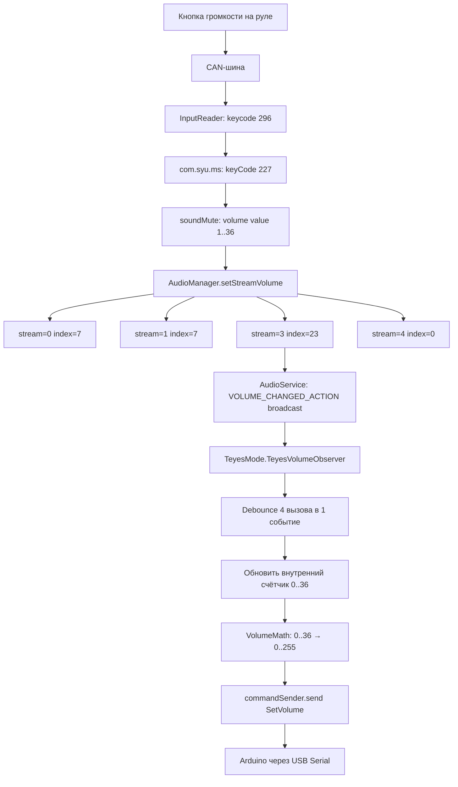

# План разработки TeyesMode — режим перехвата громкости для устройств Teyes

## Результаты анализа логов

### Устройство
- **Производитель**: sprd (Spreadtrum/Unisoc)
- **Модель**: uis8581a2h10_Automotive (Android 10, API 29)
- **Системное приложение**: `com.syu.ms` (SYU Music Service) — центральный менеджер аудио Teyes

### Механизм управления громкостью на Teyes

```
Кнопка на руле → CAN-шина → InputReader (keycode 296) 
→ com.syu.ms (keyCode 227) → soundMute (volume value 1..36)
→ AudioManager.setStreamVolume() для потоков 0,1,3,4
```

**Ключевая особенность**: `com.syu.ms` всегда устанавливает `STREAM_MUSIC = 23` (максимум), 
а реальная громкость (1..36) хранится внутри `com.syu.ms` и управляется через DSP (теги `c32107`, `C7604`).
Поэтому стандартный [`VolumeObserver`](core/src/main/java/com/example/volumemonitor/core/volume/VolumeObserver.kt:26) **не может отследить изменение громкости Teyes** 
через `STREAM_MUSIC`, т.к. его значение всегда 23.

### Параметры громкости Teyes
| Параметр | Значение |
|----------|----------|
| Диапазон громкости | 1..36 |
| KeyCode кнопок громкости | 227 (key) / 296 (InputReader FYT) |
| STREAM_MUSIC | всегда 23 (не меняется) |
| STREAM_ALARM (4) | всегда 0 |
| STREAM_SYSTEM (1) | всегда 7 |
| STREAM_VOICE_CALL (0) | всегда 7 |

---

## Стратегия TeyesMode

### Проблема
`ObserverMode` отслеживает изменения `STREAM_MUSIC` через `VOLUME_CHANGED_ACTION`. 
На Teyes `STREAM_MUSIC` всегда равен 23, поэтому `VolumeObserver` не видит изменений.

### Решение: гибридный подход

TeyesMode будет комбинировать два механизма:

1. **Отслеживание вызовов `setStreamVolume`**: 
   - `com.syu.ms` вызывает `setStreamVolume` для всех потоков при КАЖДОМ изменении громкости
   - Даже если значение `STREAM_MUSIC` не меняется (всегда 23), сам факт вызова — это событие изменения громкости
   - Модифицированный `VolumeObserver` будет регистрировать факт вызова `setStreamVolume`

2. **Внутренний счётчик громкости**:
   - TeyesMode хранит собственное значение громкости (0..36)
   - При каждом событии `setStreamVolume` счетчик изменяется на ±1
   - Направление (±) определяется через дополнительные механизмы

3. **Перехват клавиш (опционально)**:
   - KeyCode 227 — кнопка MUTE на Teyes (уменьшение громкости?)
   - KeyCode 296 — FYT-специфичная кнопка
   - Можно использовать существующий `ButtonPressService` для перехвата

4. **Прямое чтение через AccessibilityService** (запасной вариант):
   - SystemUI Teyes показывает громкость через `hzqvol` (TextView с id `vol_text`)
   - Можно читать значение громкости с экрана через AccessibilityService

### Рекомендуемая стратегия (для первой версии)

**Самый надёжный подход**: использовать модифицированный `VolumeObserver`, который:
- Слушает `VOLUME_CHANGED_ACTION` для **всех** потоков (не только STREAM_MUSIC)
- При получении broadcast-события (даже с тем же значением) фиксирует факт изменения
- Дебаунсит множественные вызовы (com.syu.ms вызывает setStreamVolume 4 раза подряд)
- Поддерживает внутренний счётчик громкости 0..36
- При старте синхронизируется: читает текущий `STREAM_MUSIC` и масштабирует в диапазон 0..36
- Отправляет значение в Arduino через `commandSender`

---

## План реализации

### Шаг 1: Добавить `TEYES` в enum [`VolumeControlMode`](core/src/main/java/com/example/volumemonitor/core/model/VolumeControlMode.kt:4)
```kotlin
enum class VolumeControlMode {
    OBSERVER,
    BUTTONS,
    SCREEN,
    BUTTON_MATRIX,
    TEYES  // <-- новый режим
}
```

### Шаг 2: Создать [`TeyesMode.kt`](core/src/main/java/com/example/volumemonitor/core/volume/mode/TeyesMode.kt)
- Наследует [`VolumeMode`](core/src/main/java/com/example/volumemonitor/core/volume/mode/VolumeMode.kt:40)
- Внутренний счётчик громкости 0..36 (настраиваемый `maxVolume`)
- Модифицированный `VolumeObserver`, отслеживающий все потоки (0,1,3,4)
- Дебаунс множественных вызовов `setStreamVolume`
- Преобразование 0..36 → 0..255 для Arduino
- Сохранение/восстановление громкости через `SettingsRepository`

### Шаг 3: Добавить константы и настройки
- `KEY_TEYES_MAX_VOLUME` = 36 (по умолчанию)
- `KEY_TEYES_CURRENT_VOLUME`
- Настройки в `SettingsRepository` / `SettingsRepositoryImpl`

### Шаг 4: Зарегистрировать в [`VolumeMonitorService`](core/src/main/java/com/example/volumemonitor/core/VolumeMonitorService.kt:152)
- Добавить `VolumeControlMode.TEYES` в `when` блок `activateMode()`

### Шаг 5: Добавить UI в [`ModesFragment`](app/src/main/java/com/example/volumemonitor/ui/ModesFragment.kt:33)
- RadioButton "Teyes (перехват громкости)" в [`fragment_modes.xml`](app/src/main/res/layout/fragment_modes.xml:50)
- Настройка максимальной громкости (ползунок/EditText для значения 1..36)

### Шаг 6: Обновить макет [`fragment_modes.xml`](app/src/main/res/layout/fragment_modes.xml:50)
- Добавить `radioTeyes` RadioButton
- Добавить `teyesMaxVolumeSettingsLayout` с EditText для максимального значения

---

## Диаграмма архитектуры TeyesMode



---

## Файлы, требующие изменений

| Файл | Изменение |
|------|-----------|
| [`VolumeControlMode.kt`](core/src/main/java/com/example/volumemonitor/core/model/VolumeControlMode.kt:4) | Добавить `TEYES` |
| **`TeyesMode.kt`** (новый) | Реализация режима |
| [`VolumeMonitorService.kt`](core/src/main/java/com/example/volumemonitor/core/VolumeMonitorService.kt:152) | Регистрация режима |
| [`SettingsRepository.kt`](core/src/main/java/com/example/volumemonitor/core/repository/SettingsRepository.kt:1) | Интерфейс: get/save методы |
| [`SettingsRepositoryImpl.kt`](core/src/main/java/com/example/volumemonitor/core/repository/SettingsRepositoryImpl.kt:9) | Реализация сохранения |
| [`Constants.kt`](core/src/main/java/com/example/volumemonitor/core/Constants.kt:3) | KEY_TEYES_* константы |
| [`ModesFragment.kt`](app/src/main/java/com/example/volumemonitor/ui/ModesFragment.kt:33) | UI выбора режима |
| [`fragment_modes.xml`](app/src/main/res/layout/fragment_modes.xml:50) | RadioButton + настройки |
| [`AppEventBus.kt`](core/src/main/java/com/example/volumemonitor/core/event/AppEventBus.kt:24) | Возможно: TeyesSettingsChanged |

---

## Открытые вопросы для обсуждения

1. **Направление изменения громкости**: Поскольку `STREAM_MUSIC` всегда 23, мы не можем определить направление из broadcast. Нужно ли добавить перехват клавиш (keyCode 227/296) через `ButtonPressService` для определения направления?

2. **Начальная синхронизация**: При старте TeyesMode, нужно ли пытаться прочитать текущую громкость через AccessibilityService (чтение TextView `vol_text` из SystemUI)?

3. **Диапазон громкости**: Пользовательский диапазон (1..36) — нужно ли дать возможность настройки этого диапазона в UI?

4. **Тестирование**: Нужно ли собрать тестовую сборку для проверки на реальном устройстве Teyes?
