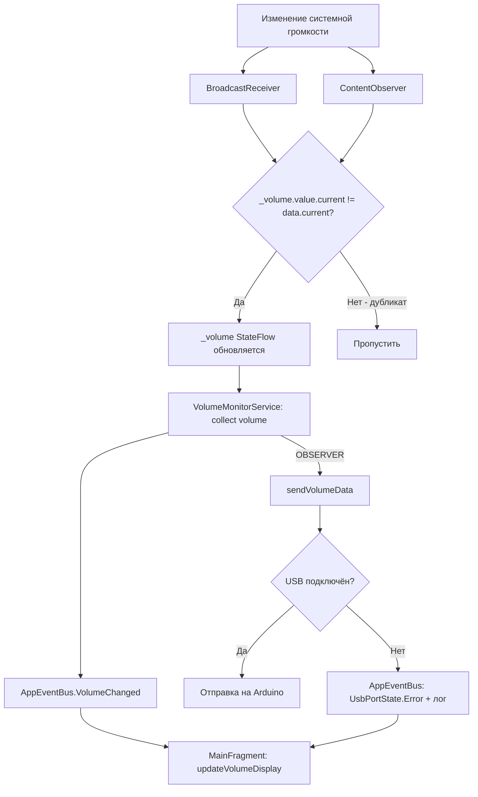

# План исправления автоматического отслеживания громкости (OBSERVER mode)

## Диагноз

После полного аудита кодовой базы выявлены следующие потенциальные причины поломки:

### 🔴 Критическая: BroadcastReceiver — ненадёжный механизм на современных Android

[`VolumeObserver.kt:48-61`](../core/src/main/java/com/example/volumemonitor/core/volume/VolumeObserver.kt:48) полагается исключительно на системный broadcast `VOLUME_CHANGED_ACTION`. На Android 12+ (API 31+) этот broadcast:

- Может не доставляться при агрессивной оптимизации батареи (Samsung, Xiaomi, Huawei)
- Может блокироваться при использовании флага `RECEIVER_NOT_EXPORTED` на некоторых прошивках
- Не имеет fallback-механизма — если broadcast не получен, громкость не синхронизируется

### 🟡 Средняя: Порядок инициализации в `onCreate()` сервиса

В [`VolumeMonitorService.kt:159-220`](../core/src/main/java/com/example/volumemonitor/core/VolumeMonitorService.kt:159):

```
159: serviceScope.launch { volumeObserver.volume.collect { ... } }  // запуск сбора ДО
...
220: volumeObserver.register()                                       // регистрации приёмника
222: autoConnectSavedDevice()                                        // и подключения USB
```

Первоначальная эмиссия StateFlow происходит до подключения USB → данные теряются.

### 🟡 Средняя: Потеря событий в AppEventBus

[`AppEventBus.kt:19`](../core/src/main/java/com/example/volumemonitor/core/event/AppEventBus.kt:19) — возвращаемое значение `tryEmit()` (Boolean) нигде не проверяется. При заполнении буфера (16 событий) новые события молча отбрасываются.

### 🟢 Малая: Хардкод строки действия

[`VolumeObserver.kt:50`](../core/src/main/java/com/example/volumemonitor/core/volume/VolumeObserver.kt:50) использует литерал `"android.media.VOLUME_CHANGED_ACTION"` вместо `AudioManager.VOLUME_CHANGED_ACTION`.

### 🟢 Малая: Молчаливая потеря данных при отключённом USB

[`UsbSerialPortManager.kt:141-143`](../core/src/main/java/com/example/volumemonitor/core/usb/UsbSerialPortManager.kt:141) — `send()` молча игнорирует данные при отсутствии подключения, только логирует warning.

---

## План исправления

### Шаг 1: Диагностическое логирование (VolumeObserver.kt)

**Цель**: понять, доходит ли broadcast до приёмника.

В [`VolumeObserver.kt`](../core/src/main/java/com/example/volumemonitor/core/volume/VolumeObserver.kt) добавить:

- Лог при регистрации приёмника (register called, SDK version, filter action)
- Лог в `onReceive()` ДО проверки action — считать количество вызовов
- Лог при фактическом изменении громкости
- Лог при пропуске (streamType != STREAM_MUSIC)
- Счётчик полученных/пропущенных broadcast'ов

```kotlin
// Пример добавляемого кода:
private var broadcastReceivedCount = 0
private var volumeChangedCount = 0

override fun onReceive(context: Context, intent: Intent) {
    broadcastReceivedCount++
    Log.d(TAG, "onReceive #$broadcastReceivedCount: action=${intent.action}")
    // ... существующая логика ...
}
```

### Шаг 2: ContentObserver как fallback (VolumeObserver.kt)

**Цель**: добавить надёжный механизм отслеживания громкости через `ContentObserver` на `Settings.System.CONTENT_URI` для ключа `VOLUME_MUSIC`.

Логика:
1. `VolumeObserver` регистрирует И `BroadcastReceiver`, И `ContentObserver`
2. `ContentObserver` слушает изменения `android.provider.Settings.System.VOLUME_MUSIC` через `Settings.System.getInt()`
3. При срабатывании любого из механизмов — обновляется `_volume` StateFlow
4. Дедубликация: если оба механизма сработали для одного изменения, StateFlow сам отфильтрует дубликат (через `_volume.value.current != data.current`)

```kotlin
class VolumeObserver(
    private val context: Context,
    private val audioManager: AudioManager
) {
    // ... существующий код ...

    private val volumeContentObserver = object : ContentObserver(Handler(Looper.getMainLooper())) {
        override fun onChange(selfChange: Boolean) {
            val data = currentVolumeData
            if (_volume.value.current != data.current) {
                Log.d(TAG, "Громкость изменилась (ContentObserver): ${data.current}")
                _volume.value = data
            }
        }
    }

    fun register() {
        _volume.value = currentVolumeData
        
        // BroadcastReceiver (существующий механизм)
        val filter = IntentFilter(AudioManager.VOLUME_CHANGED_ACTION)
        if (Build.VERSION.SDK_INT >= Build.VERSION_CODES.TIRAMISU) {
            context.registerReceiver(volumeReceiver, filter, Context.RECEIVER_NOT_EXPORTED)
        } else {
            context.registerReceiver(volumeReceiver, filter)
        }
        
        // ContentObserver (новый fallback)
        context.contentResolver.registerContentObserver(
            android.provider.Settings.System.CONTENT_URI, true, volumeContentObserver
        )
        
        Log.d(TAG, "VolumeObserver зарегистрирован (BroadcastReceiver + ContentObserver)")
    }

    fun unregister() {
        try { context.unregisterReceiver(volumeReceiver) } catch (_: Exception) {}
        context.contentResolver.unregisterContentObserver(volumeContentObserver)
    }
}
```

### Шаг 3: Исправить порядок инициализации (VolumeMonitorService.kt)

**Цель**: гарантировать, что `register()` вызывается ДО запуска `collect`.

В [`VolumeMonitorService.kt:141-223`](../core/src/main/java/com/example/volumemonitor/core/VolumeMonitorService.kt:141) изменить порядок:

```
Было:
  159: serviceScope.launch { volumeObserver.volume.collect { ... } }
  ...
  220: volumeObserver.register()

Стало:
  volumeObserver.register()
  serviceScope.launch { volumeObserver.volume.collect { ... } }
```

### Шаг 4: Исправить хардкод строки (VolumeObserver.kt)

Заменить:
```kotlin
// Строка 50:
if (intent.action == "android.media.VOLUME_CHANGED_ACTION") {
// Строка 65:
val filter = IntentFilter("android.media.VOLUME_CHANGED_ACTION")
```

На:
```kotlin
if (intent.action == AudioManager.VOLUME_CHANGED_ACTION) {
val filter = IntentFilter(AudioManager.VOLUME_CHANGED_ACTION)
```

### Шаг 5: Обработка dropped events (AppEventBus.kt + VolumeMonitorService.kt)

В [`VolumeMonitorService.kt`](../core/src/main/java/com/example/volumemonitor/core/VolumeMonitorService.kt):
- Проверять возвращаемое значение `AppEventBus.tryEmit()` и логировать dropped events
- Для критических событий (VolumeChanged) использовать `serviceScope.launch { AppEventBus.emit(event) }` (suspend-версия, которая ждёт освобождения буфера)

```kotlin
// Было:
AppEventBus.tryEmit(AppEvent.VolumeChanged(data.current, data.target))

// Стало:
val emitted = AppEventBus.tryEmit(AppEvent.VolumeChanged(data.current, data.target))
if (!emitted) {
    Log.w(TAG, "VolumeChanged event dropped — buffer full")
    serviceScope.launch { AppEventBus.emit(AppEvent.VolumeChanged(data.current, data.target)) }
}
```

### Шаг 6: Уведомление при невозможности отправки (UsbSerialPortManager.kt)

В [`UsbSerialPortManager.kt:141-143`](../core/src/main/java/com/example/volumemonitor/core/usb/UsbSerialPortManager.kt:141) вместо молчаливого пропуска эмитить событие `AppEvent.UsbStatusChanged(UsbPortState.Error("USB не подключено — данные громкости не отправлены"))`.

---

## Схема исправленной архитектуры



---

## Файлы, требующие изменений

| Файл | Изменения |
|------|-----------|
| [`core/.../volume/VolumeObserver.kt`](../core/src/main/java/com/example/volumemonitor/core/volume/VolumeObserver.kt) | ContentObserver + диагностическое логирование + AudioManager.VOLUME_CHANGED_ACTION |
| [`core/.../VolumeMonitorService.kt`](../core/src/main/java/com/example/volumemonitor/core/VolumeMonitorService.kt) | Порядок инициализации + проверка tryEmit |
| [`core/.../usb/UsbSerialPortManager.kt`](../core/src/main/java/com/example/volumemonitor/core/usb/UsbSerialPortManager.kt) | Эмитировать событие при невозможности отправки |
